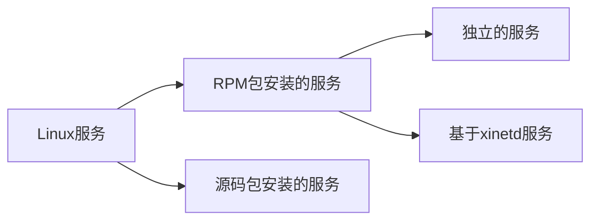

---
{"title":"[[linux学习过程]]","mathjax":true,"aliases":null,"author":"fun","tags":["linux"],"categories":"linux","description":"初步学习linux","id":"learnlinux","date":"2019-12-10","updated":"2024-05-07T12:44:23.251+08:00","comments":true,"publish":true,"dg-publish":true,"permalink":"/01 学习笔记/技术学习/linux学习过程/","dgPassFrontmatter":true,"created":"2024-04-28T22:11:08.255+08:00"}
---


## linux注意事项

1. 严格区分大小写（命令、文件名等）

2. Linux中所有内容以文件形式保存，包括硬件

   + 硬件文件是/dev/sd[a-p]
   + 光盘文件是/dev/sr0等

3. Linux不靠扩展名区分文件类型（靠的是文件权限）

   - 压缩包：”\*.gz“、”\*.bz2“、”\*.tar.bz2“等
   - 二进制包：”rpm“等
   - 网页文件：”\*.html“
   - 脚本文件：”\*.sh"
   - 配置文件：“\*.conf”

   但是这些扩展名是给管理员看的，其实并不需要。主要是便于识别，非必须。

4. Linux所有的存储设备都必须挂载，只有用户才能使用，包括硬盘、U盘和光盘

5. Windows下的程序不能直接在Linux中安装和运行

6. 服务器注意事项：

   - 远程服务器不允许关机，只能重启

   - 重启时应该关闭服务
   - 不要在服务器访问高峰运行高负载命令
   - 远程配置防火墙不要把自己踢出服务器
   - 制定合理的密码规范并定期更新
   - 合理分配权限
   - 定期备份重要数据和日志

## Linux各个目录的作用

- /bin/ 　存放系统命令的目录，普通用户和超级用户都可以执行. 不过放在/bin下的命令在单用户模式下也可以执行 。 
- /sbin/　保存和系统环境设置相关的命令，只有超级用户可以使用这些命令进行系统环境设置，但是有些命令可以允许普通用户查看。
- /usr/bin/　存放系统命令的目录，普通用户和超级用户都可以执行。这些命令和系统无关，在单用户模式下不能执行。
- /usr/sbin/　存放根文件系统不必要的系统管理命令，例如多数服务程序。只有超级用户可以使用。
- /boot/　系统启动目录，保存系统启动相关文件。如内核文件和启动引导程序。
- /dev/　 设备文件保存位置。
- /etc/　配置文件保存位置。系统内所有采用默认安装(rpm安装)的服务的配置文件全部都保存在这个目录当中。如用户的账号和密码，服务的启动脚本。常用服务的配置文件等。
- /home/　普通用户的家目录。建立每个用户时，每个用户要有一个默认的登录位置，这个位置就是这个用户的家目录。所有普通用户的家目录就是在/home下建立一个和用户名相同的目录。如user1的家目录就是/home/user1
- /lib/ 　 系统调用的函数库保存位置
- /lost+found/　当系统意外崩溃或意外关机，而产生一些文件碎片放在这里。当系统启动的过程中fsck工具会检查这里，并修复已损坏的文件系统。这个目录只在每个分区中出现，例如/lost+found 就是根分区的备份恢复录，/boot/lost+found 就是/boot分区的备份恢复目录。
- /media/ 　挂载目录，系统建议是用来挂载媒体设备的，例如软盘和光盘。
- /mnt/ 　　挂载目录，早期linux中只有这一个挂载目录，并没有细分，现在这个目录系统建议挂载额外设备，例如U盘，移动硬盘和其他操作系统的分区
- /misc/ 　挂载目录， 系统建议用来挂载NFS服务的共享目录。
- /opt/ 　第三方安装的软件保存位置。 这个目录就是放置和安装其他软件的位置。现在行业习惯是安装在在usr/local/目录中。
- /proc/ 　虚拟文件系统，该目录中的数据并不保存到硬盘当中，而是保存到内存当中。 主要保存系统的内核，进程。外部设备状态和网络状态灯。如/proc/cpuinfo 是保存cpu信息的，/proc/devices是保存设备驱动的列表的，/proc/filesystems是保存文件系统列表的， /proc/net是保存网络协议信息的。注意不要往里面写东西。
- /sys/　虚拟文件系统，和/proc目录相似，都是保存在内存当中的，主要是保存于内核相关信息的。
- /root/ 　超级用户的家目录，普通用户家目录在"/home"下，超级用户家目录直接在 “/”下。
- /srv/ 　服务数据目录.一些系统服务启动之后，可以在这个目录中保存所需要的数据。
- /tmp/　临时目录，系统存在临时文件的目录. 该目录下所有用户都可以访问和写入，建议此目录中不能存放重要数据，最好每次开机都可以把该目录清空
- /usr/ 　系统软件资源目录，"unix softwre resource"的缩写，存在系统软件资源的目录。系统中安装的软件大多数保存在这里。
- /var/ 　动态数据保存位置，主要保存缓存，日志已经软件运行所产生的文件。

## Linux常用命令

### 文件处理命令

#### 命令格式与目录处理命令ls

- 命令格式：命令 [-选项] [参数]
  例 : ls -la /etc

- 说明:   

  1. 个别命令使用不遵循此格式
  2. 当有多个选项时,可以写在一起
  3. 简化选项与完整选项
     -a 等于 --all

- 目录处理命令

  命令名称: ls

  命令英文原意: list

  命令所在路径: /bin/ls

  执行权限: 所有用户

  功能描述: 显示目录文件

  语法:  ls 选项[-ald] [文件或目录]
                 -a 显示所有文件,包括隐藏文件
                 -l 详细信息显示
                 -d 查看目录属性

- -rw-r--r--

  \- 文件类型(- 文件 d 目录 l 软链接文件)
  rw- r-- r--
  u    g   o
  u所有者   g所属组   o其他人
  r读 w写 x执行

#### 目录处理命令

##### mkdir

- 命令名称:mkdir
- 命令英文原意:make directories
- 命令所在路径:/bin/mkdir
- 执行权限:所有用户
- 语法:mkdir -p [目录名]
- 功能描述:创建新目录
- -p 递归创建
- 范例: $ mkdir -p /tmp/Japan/boduo
  $ mkdir /tmp/Japan/longze /tmp/Japan/cangjing

##### cd

- 命令名称:cd

- 命令英文原意:change directory

- 命令所在路径:shell内置命令

- 执行权限:所有用户

- 语法:cd [目录]

- 功能描述:切换目录

- 范例:   \$ cd  /tmp/Japan/boduo 切换到指定目录

  ​            \$cd ..        回到上一级目录

  ​            $cd ../..     回到上上一次所在目录

  ​            $cd -         返回上两级目录            

#####  pwd

- 命令名称:pwd
- 命令英文原意:print working directory
- 命令所在路径:/bin/pwd
- 执行权限:所有用户
- 语法:pwd
- 功能描述:显示当前目录
- 范例:  $ pwd  显示当前目录

##### rmdir

- 命令名称:rmdir
- 命令英文原意:remove empty directories
- 命令所在路径:/bin/rmdir
- 执行权限:所有用户
- 语法:rmdir [目录名]
- 功能描述: 删除空目录
- 范例: $ rmdir /tmp/linux/test

##### cp

- 命令名称: cp

- 命令英文原意: copy

- 命令所在路径: /bin/cp

- 执行权限: 所有用户

- 语法: cp  -rp [原文件或目录] [目标目录]

  ​                -r 递归复制目录及内部的所有内容

  ​                -p 保留文件属性

  ​                -f 强制

  ​                -i 目标文件以存在，则在覆盖前询问是否覆盖 

  ​                -u 若源文件比目标文件新，则覆盖，否则跳过

- 功能描述:复制文件或目录

##### mv

- 命令名称:mv
- 命令英文原意:move
- 命令所在路径:/bin/mv
- 执行权限:所有用户
- 语法:mv [原文件或目录] [目标目录]
- 功能描述:剪切文件、改名

##### rm

- 命令名称:rm
- 命令英文原意:remove
- 命令所在路径:/bin/rm
- 执行权限:所有用户
- 语法:  rm -rf [文件或目录]

​                        -r 删除目录

​                        -f 强制执行

- 功能描述:删除文件

#### 文件处理命令

##### touch

- 创建空文件

- ```
  touch file_name
  ```

##### cat

- 语法: cat [文件名]

- 功能描述: 显示文件内容

  ​                 \-n 显示行号  

##### tac

- 语法:tac [文件名]
- 功能描述:显示文件内容(反向列示)

##### more

- 语法:more [文件名]

​         (空格) 或f   翻页
​         (Enter)       换行
​         q或Q          退出

- 功能描述:分页显示文件内容

##### less

- 语法:less [文件名]

- 功能描述:分页显示文件内容(可向上翻页)

##### head

- 语法:head [文件名]
- 功能描述:显示文件前面几行
      -n 指定行数

##### tail

- 语法:tail [文件名]

- 功能描述:显示文件后面几行
      -n 指定行数
      -f 动态显示文件末尾内容

- ```bash
  tail -n 100 /etc/cron  #显示最后100行数据
  tail -n -100 /etc/cron #除了前99行不显示外，显示第100行到末尾行
  ```

#### 链接命令

##### ln

- 语法:ln -s [原文件] [目标文件]
      -s 创建软链接
- 功能描述:生成链接文件

```bash
$ ln -s /etc/issue /tmp/issue.soft
  创建文件/etc/issue的软链接/tmp/issue.soft
$ ln /etc/issue /tmp/issue.hard
  创建文件/etc/issue的硬链接/tmp/issue.hard
```

- 软链接特征:类似Windows快捷方式
  1、lrwxrwxrwx l 软链接
        软链接文件权限都为rwxrwxrwx
  2、文件大小-只是符号链接
  3、/tmp/issue.soft -> /etc/issue
        箭头指向原文件
- 硬链接特征:
  1、拷贝cp -p + 同步更新
        echo "this is a test" >> /etc/motd
  2、可通过i节点识别
  3、不能跨分区
  4、不能针对目录使用

### 权限管理命令

#### chmod

- 语法:chmod [{ugoa}{+-=}{rwx}] [文件或目录]
      [mode=421 ] [文件或目录]
      -R 递归修改

- - u 表示该文件的拥有者，g 表示与该文件的拥有者属于同一个群体(group)者，o 表示其他以外的人，a 表示这三者皆是。
  - 表示增加权限、- 表示取消权限、= 表示唯一设定权限。
  - r 表示可读取，w 表示可写入，x 表示可执行，X 表示只有当该文件是个子目录或者该文件已经被设定过为可执行。

- 功能描述:改变文件或目录权限

- 将目前目录下的所有文件与子目录皆设为任何人可读取 :

  ```
  chmod -R a+r *
  ```

- ```
  chmod pqn file
  ```

  其中p,q,n各为一个数字，分别表示User、Group、及Other的权限。

  r=4，w=2，x=1

  - 若要rwx属性则4+2+1=7；
  - 若要rw-属性则4+2=6；
  - 若要r-x属性则4+1=5。

- ```
  chmod a=rwx file
  ```

  和

  ```
  chmod 777 file
  ```

  效果相同

  ```
  chmod ug=rwx,o=x file
  ```

  和

  ```
  chmod 771 file
  
  ```

  效果相同

#### 其他权限管理命令

##### chown

- 语法:chown [用户] [文件或目录]

- 功能描述:改变文件或目录的所有者

- 范例:$ chown usr_1 file_1

  改变文件file_1的所有者为usr_1

##### chgrp

- 语法:chgrp [用户组] [文件或目录]
- 功能描述:改变文件或目录的所属组
- 范例:$ chgrp lampbrother file_1
      改变文件file_1的所属组为lampbrother

##### umask

- 语法:umask [-S]

  ​         -S 以rwx形式显示新建文件缺省权限

- 功能描述:显示、设置文件的缺省权限

- 范例: $ umask -S

### 文件搜索命令

find

- 功能描述:文件搜索

- 语法:

  ```bash
  $ find  path  -option  【 -print 】  【 -exec  -ok  |xargs  |grep  】 【  command  {} \;  】
  
  ```

- **path**：要查找的目录路径。 

  -    ~ 表示$HOME目录
  -    ​    **.** 表示当前目录
  -    ​    / 表示根目录 

- **-exec**　对搜索到的文件执行特定的操作，固定的格式为：`-exec 'commond' {} \`;  **注意：{} 表示查询的结果。**

  举例1: 搜索 /etc 目录下的文件（非目录），文件以 conf 结尾，且大于 10k，然后将其删除。

  ```
  find /etc -type f -name '*.conf' -size +10k -exec rm -f {} \
  
  ```

- **ok**：与exec作用相同，
      区别在于，在执行命令之前，都会给出提示，让用户确认是否执行 

- **|xargs** 与exec作用相同 ，起承接作用

  区别在于 **|xargs** 主要用于承接删除操作 ，而 **-exec** 都可用 如复制、移动、重命名等

- ```
  -name  filename        #查找名为filename的文件
  -iname filename        #不区分大小写
  -user  user_1　        #查找文件所属用户为user_1的所有文件
  -group group_1         #查找文件所属组为group_1的所有文件
  -type　　根据类型查找：如下
  　　　　　　f　　文件　　　　　　　  find . -type f
  　　　　　　d　　目录　　　　　　　　find . -type d
  　　　　　　c　　字符设备文件　　　　find . -type c
  　　　　　　b　　块设备文件　　　　　find . -type b
  　　　　　　l　　链接文件　　　　　  find . -type l
  　　　　　　p　　管道文件　　　　　　find . -type p
  -size　   根据文件大小查询
  　　　　　　-n　　小于 大小为 n 的文件
  　　　　　　+n　　大于 大小为 n 的文件
  -mtime　　
  　　　　　　-n　　n 天以内修改的文件。
  　　　　　　+n　　n 天以外修改的文件。
  　　　　　　n　　 正好 n天 修改的文件
  -mmin　　
  　　　　　　-n　　n 分钟以内修改过的文件
   　　　　　 +n　　n 分钟之前修改过的文件
  -perm     #按执行权限来查找
  -mindepth n　　从第 n 级目录开始搜索
  -maxdepth n　　表示至多搜索到第 n-1 级子目录。
  
  #逻辑运算符　
  -a　　　　与  （默认情况查询条件之间都是 与 的关系）
  -o　　　　或
  -not | ！　 非 
  
  ```

#### 其他搜索命令

##### locate

- 语法:locate 文件名
- 功能描述: 在文件资料库中查找文件

##### which

- 语法:which 命令
- 功能描述:搜索命令所在目录及别名信息
- 范例: `$ which ls`

##### whereis

- 语法:whereis [命令名称]
- 功能描述:搜索命令所在目录及帮助文档路径
- 范例:$ whereis ls

##### grep

- 语法:grep -iv [指定字串] [文件]

- 功能描述:在文件中搜寻字串匹配的行并输出

  ​                -i 不区分大小写

  ​                -v 排除指定字串

- 范例:# grep mysql /root/install.log

### 帮助命令

#### man

- 语法:man [命令或配置文件]
- 功能描述:获得帮助信息
- 范例:  \$ man ls   查看ls命令的帮助信息
      \$ man services    查看配置文件services的帮助信息

#### help

- 语法:help 命令
- 功能描述:获得Shell内置命令的帮助信息
- 范例: $ help umask  查看umask命令的帮助信息

### 用户管理命令

#### useradd

- 执行权限:root
- 语法:useradd 用户名
- 功能描述:添加新用户
- 范例: $ useradd finyorko

#### passwd

- 执行权限:所有用户
- 语法:passwd 用户名
- 功能描述:设置用户密码
- 范例: $ passwd finyorko

#### who

- 执行权限:所有用户
- 语法:who
- 功能描述:查看登录用户信息
- 范例: $ who

#### w

- 执行权限:所有用户
- 语法:w
- 功能描述:查看登录用户详细信息
- 范例: $ w

### 压缩解压命令

#### gzip压缩

- 语法: gzip [文件]
- 功能描述: 压缩文件
- 压缩后文件格式:   .gz

#### gunzip解压

- 语法:gunzip [压缩文件]
- 功能描述:解压缩.gz的压缩文件
- 范例: $ gunzip boduo.gz

#### tar压缩

- 语法:tar 选项[-zcf] [压缩后文件名] [目录]
      -c 打包
      -v 显示详细信息
      -f 指定文件名
      -z 打包同时压缩  
- 功能描述:打包目录
- 压缩后文件格式: .tar.gz
- 范例:  `$ tar -zcf Japan.tar.gz Japan  `将目录Japan打包并压缩为Japan.tar.gz文件

#### tar解压

- tar命令解压缩语法:
  -x 解包
  -v 显示详细信息
  -f 指定解压文件
  -z 解压缩
  -C 指定需要解压到的目录
- -r：向压缩归档文件末尾追加文件 
  -u：更新原压缩包中的文件

- 范例:$ tar -zxvf Japan.tar.gz

#### zip压缩

- 语法:   zip 选项[-r] [压缩后文件名] [文件或目录]
      -r 压缩目录
- 功能描述:压缩文件或目录
- 压缩后文件格式:.zip

- 范例:
  \$ zip buduo.zip boduo      压缩文件
  ​\$ zip -r Japan.zip Japan      压缩目录

#### unzip解压

- 语法:unzip [压缩文件]
- 功能描述:解压.zip的压缩文件
- 范例:\$ unzip test.zip

#### bzip2压缩

- 语法: bzip2 选项 [-k] [文件]
      -k 产生压缩文件后保留原文件
- 功能描述:压缩文件
- 压缩后文件格式:   .bz2
- 范例:  \$ bzip2 -k boduo
  ​           \$ tar -cjf Japan.tar.bz2 Japan

#### bunzip解压

- 语法: bunzip2 选项 [-k] [压缩文件]
      -k 解压缩后保留原文件
- 功能描述:解压缩
- 范例: \$ bunzip2 -k boduo.bz2
      \$ tar -xjf Japan.tar.bz2

### 网络命令

#### write

- 语法:write <用户名>
- 功能描述:给用户发信息,以Ctrl+D保存结束
- 范例: # write finyorko

#### wall

- 命令英文原意:write all
- 执行权限:所有用户
- 语法:wall [message]
- 功能描述:发广播信息
- 范例: # wall Finyorko is a honest man!

#### ping 

- 语法:ping 选项 IP地址
      -c 指定发送次数
- 功能描述:测试网络连通性
- 范例: # ping 192.168.1.156

#### ifconfig

- 命令英文原意:interface configure
- 执行权限:root
- 语法:ifconfig 网卡名称 IP地址
- 功能描述:查看和设置网卡信息
- 范例:  # ifconfig eth0 192.168.8.250

#### mail

- 语法:mail [用户名]
- 功能描述:查看发送电子邮件
- 范例:# mail root

#### last

- 语法:last
- 功能描述:列出目前与过去登入系统的用户信息

#### lastlog

- 语法:lastlog
- 功能描述:检查某特定用户上次登录的时间
- 范例 :  \$ lastlog
      \$ lastlog -u 502

#### traceroute

- 语法:traceroute
- 功能描述:显示数据包到主机间的路径
- 范例:# traceroute www.lampbrother.net

#### netstat

- 语法:netstat [选项]

- 功能描述:显示网络相关信息

- 选项:
  -t :   TCP协议
  -u :  UDP协议
  -l :   监听
  -r :  路由
  -n : 显示IP地址和端口号

- 范例:

  \#netstat -tlun  查看本机监听的端口

  \#netstat -an    查看本机所有的网络连接

  \#netstat -rn     查看本机路由表

#### setup

- 语法:setup
- 功能描述:配置网络
- 范例:# setup

#### mount

- mount [-t 文件系统] 设备文件名 挂载点

- 范例:# mount -t  iso9660  /dev/sr0 /mnt/cdrom

### 关机重启命令

#### shutdown

- shutdown [选项] 时间
- 选项:
  -c: 取消前一个关机命令
  -h: 关机
  -r: 重启

#### 其他关机命令

halt

poweroff

init 0

#### 其他重启命令

reboot

init 6

#### 系统运行级别

- 0     关机
- 1     单用户
- 2     不完全多用户,不含NFS服务
- 3     完全多用户
- 4     未分配
- 5     图形界面
- 6     重启

- 修改默认系统运行级别   `cat /etc/inittab`
- 查询系统运行级别  `runlevel`

#### 退出登录命令

`logout`

## 文本编辑器Vim

### Vim常用操作

#### 插入命令

| 命令 | 作用                 |
| :--: | :------------------- |
|  a   | 在光标所在字符后插入 |
|  A   | 在光标所在行尾插入   |
|  i   | 在光标所在字符前插入 |
|  I   | 在光标所在行行首插入 |
|  o   | 在光标下插入新行     |
|  O   | 在光标上插入新行     |

#### 定位命令

|     命令     | 作用                                                         |
| :----------: | ------------------------------------------------------------ |
| `: set nu `  | 设置行号                                                     |
| `: set nonu` | 取消行号                                                     |
|    `gg `     | 到第一行                                                     |
|     `G`      | 到最后一行                                                   |
|     `nG`     | 到第n行                                                      |
|  `n<space>`  | n表示数字, 按下数字而后按空格(不用同时, 先后顺序), 光标会右移n格. |
|  `n<enter>`  | n为数字, 输入数字再按回车, 光标向下移n行.                    |
|    `: n`     | 到第n行                                                      |
|     `$`      | 移至行尾                                                     |
|     `0`      | 移至行首                                                     |
|  `Ctrl + f`  | 屏幕向下翻动一页, 相当于`Page Down`按键                      |
|  `Ctrl + b`  | 屏幕向上翻动一页, 相当于`Page Up`按键                        |

#### 删除复制和粘贴命令

| 命令            | 作用                                                         |
| :-------------- | :----------------------------------------------------------- |
| `x`/`X`         | 在当前刚标处进行删除操作. `x`为向后删除(删除光标所在字符), `X`为向前删除(删除光标所在前一个字符). |
| `n` `x`/`X`     | `n`为数字, 删除规则与上述一致, 不过删除数量为n               |
| `D`             | 删除光标所在处到行尾内容                                     |
| `:n1,n2d`       | 删除指定范围的行                                             |
| `dd`            | 删除/剪切光标所在整行.                                       |
| `ndd`           | 删除/剪切光标所在向下n行(包括光标所在行总共n行).             |
| `d1G`           | 删除光标所在到第一行所以数据.(包括光标行)                    |
| `dG`            | 删除光标所在到最后一行所以数据.(包括光标行)                  |
| `d$`            | 删除光标所在到该行最后一个字符(包括光标所在字符)             |
| `d0`            | 删除光标所在到该行第一个字符.(不包括光标所在)                |
| `yy`            | 复制光标所在行.                                              |
| `nyy`           | 复制光标所在向下n行. (包括该行)                              |
| `y1G`           | 复制光标所在到第一行所以数据.(包括光标行)                    |
| `yG`            | 复制光标所在到最后一行所以数据.(包括光标行)                  |
| `y0`            | 复制光标所在到该行第一个字符.(不包括光标所在)                |
| `y$`            | 复制光标所在到该行最后一个字符(包括光标所在字符)             |
| `p`/`P`         | `p`为将复制内容粘贴到光标所在的下一行. `P`为将复制内容粘贴到光标所在上一行. |
| `J`             | 将光标所在行与下一行的数据结合成为一行.                      |
| `u`             | 恢复前一个动作. 撤销.                                        |
| `Ctrl` + `r`    | 重复上一个动作.                                              |
| `.`             | 重复上一个动作.                                              |
| `:n1, n2 co n3` | 将n1与n2行之间的内容复制到第n3行(之后).                      |
| `:n1, n2 m n3`  | 将n1与n2行之间的内容剪切到第n3行(之后).                      |

#### 替换和取消命令

| 命令 | 作用                               |
| :--: | :--------------------------------- |
| `r`  | 取代光标所在处字符                 |
| `R`  | 从光标所在处开始替换字符,按Esc结束 |
| `u`  | 取消上一步操作                     |

#### 搜索和搜索替换命令

| 命令                     | 作用                                                         |
| :----------------------- | :----------------------------------------------------------- |
| `/word`                  | 从光标所在之下搜索word字符串<br/>搜索时忽略大小写 :set ic    |
| `?word`                  | 从光标所在之上搜索word字符串                                 |
| `n`                      | 重复前一个搜索动作. 对于`/word`即为向下查找匹配. `?word`为向上查找匹配. |
| `N`                      | 与`n`相反                                                    |
| `:n1, n2s/word1/word2/g` | 在n1到n2之间查找word1, 并将其替换为word2.                    |
| `:1,$s/word1/word2/g`    | 在全文查找word1替换成word2                                   |
| `:1,$s/word1/word2/gc`   | 在全文查找word1替换成word2并在替换前向用户确定.              |
| `:s/world1/word2`        | 将光标所在行的第一个word1替换成word2                         |
| `:s/word1/word2/g`       | 将光标所在整行的word1换成word2                               |

搜索后找到的字符串会被高亮显示, 恢复的方式为`:noh`即可.

#### 保存和退出命令

|         命令          | 作用                                            |
| :-------------------: | ----------------------------------------------- |
|         `:w`          | 保存修改                                        |
|         `:w!`         | 强制保存(是否真正能够保存取决于用户权限)        |
|   `:w new_filename`   | 另存为指定文件                                  |
| `:n1, n2, w filename` | 将n1到n2之间内容另存为                          |
|     `:r filename`     | 打开文档将打开的文档内容添加到当前光标所在行后. |
|         `:wq`         | 保存修改并退出                                  |
|         `ZZ`          | 快捷键,保存修改并退出                           |
|         `:q`          | 退出                                            |
|         `:q!`         | 不保存修改退出                                  |
|         `:wq`         | 保存并退出                                      |
|        `:wq!`         | 保存并退出(文件所有者及root可使用)              |
|       `:set nu`       | 设置显示行号                                    |
|      `:set nonu`      | 设置取消行号                                    |

### vim暂存机制

很多编辑软件都有恢复功能 ，即当系统因为某些原因而导致编辑中的文件突然退出．可以通过暂存的文件进行恢复．vim当然也存在这样一个机制．当我们使用vim打开一个文件时，在文件所在目录会自动创建一个.filename.swap文件．对原文件的操作会被记录在其中．当突然退出时，.filename.swap文件会帮我们存储下对文件的修改．当我们再次打开是可以选择是否通过该文件恢复对原文件的修改．

注意：当vim默认设置文件中存在如下字段时就不会有暂存机制．

```
set noswapfile

```

配置文件一般在`~/.vimrc`．

暂存机制主要适用于两种情况．

1. 在编辑文件过程中vim意外终止(在打开文件时.filename.swap文件已经被自动创建, 当正常退出时会自动删除).
2. 多人编辑同一个文件.(在你之前有人已经打开了该文件正在编辑.)

当存在暂存文件已经存在而你右对原文件进行操作而异常退出时会生成第二个暂存文件, 以此类推.

当暂存文件存在时打开文件就会提示响应的操作,解释如下:

| `[O]pen Read-Only` | 只读模式打开.                                       |
| :----------------- | :-------------------------------------------------- |
| `[E]dit anyway`    | 正常方式打开, 不载入暂存文件.                       |
| `[R]ecover`        | 加载暂存文件. 不过不会自动删除, 完成后需要自己删除. |
| `[Q]uit`           | 退出                                                |
| `[D]elete it`      | 不载入暂存文件直接将暂存文件删除                    |
| `A(bout)`          | 类似与退出.                                         |

在较新版本的vim中该功能似乎以及取消了(默认`set noswapfile`), 通过实验发现确实存在一些问题.所以尽量不要使用为好.

### vim高级操作

#### vim区块选择

区块选择用来操作一个区域. 下面是区块选择键含义.

| `v`        | 进行区块选择, 按照进过字符选择. 即按`v`后,操作光标移动, 将会将移动范围内的内容反白标注选中. |
| :--------- | :----------------------------------------------------------- |
| `V`        | 与上面一个类似, 不过是按照行来选取.                          |
| `Ctrl`+`v` | 区块选则, 按照长方形区域选取.即按下`Ctrl`+`v`的位置为一个顶点,操纵光标选择第二个顶点. 选择这两个顶点之间的区域. 需要注意的是, 如果复制矩形区域进行粘贴操纵, 赞帖也是按照矩形区域进行的. |
| `y`        | 复制选中区域                                                 |
| `d`        | 复制选中区域                                                 |

区块选则在实际编程操作中使用是否有用. 区块选择后也可以进入编辑模式进行编辑, 例如将多行代码注释掉(或相反操作)只需要将对于的区块选择, 按`I`进入插入模式, 添加注释, 按`Esc`退出即可. 过程中按下`Esc`会过一会儿才出现, 别着急(一般第一行直接出现).

#### 多档案编辑

我们可以一次打开多个文件进行一起操作. 实现分别打开无法完成的操作,如将一个文件的一部分复制到另一个文件中. 打开多文件方式为vim后面接多个文件名.

例:

```
$ vim file1 file2

```

多文档编辑操作:

| `:n`     | 编辑下一个文件             |
| :------- | :------------------------- |
| `:N`     | 编辑上一个文件             |
| `:files` | 列出当前vim开启的所以文件. |

#### 多窗口编辑

上面的操作需要使用指令进行切换而且无法同时查看两个文件, 这对于编程时是十分不方便的, 要能够保存上面多文档的便捷和查看多文件的舒适多窗口才是王道.

多窗口操作:

| `:sp filename`          | 开启一个新的窗口, 如果参数filename则在新窗口打开对于文件,否则打开当前文件. |
| :---------------------- | :----------------------------------------------------------- |
| `[Ctrl]`+`w`+`j`/下箭头 | 按键操作是先`[Ctrl]`+`w`, 而后松开按第三个键. 切换到下一个窗口中. |
| `[Ctrl]`+`w`+`k`/上箭头 | 切换到上一个窗口中.                                          |
| `[Ctrl]`+`w`+`q`        | 退出当前窗口. 可以按照这个操作,也可以直接在当前窗口`:q`      |

#### 操作目录

| `:Ex`  | 在当前窗口开启目录浏览器.     |
| :----- | :---------------------------- |
| `:Sex` | 新打开一个窗口开启目录浏览器. |

## Linux软件安装

### 编译安装方式

(小贴士:使用编译安装前,需要先建立编译环境,使用以下命令建立基本的编译环境:
sudo apt-get install build-essential)
在 linux 的世界,有很多软件只提供了源代码给你,需要你自己进行编译安装,一般开源的软件都会使用 tar.gz 压缩档来进行发布,当然也有其他的形式。拿到源代码的压缩文档
把它解压到/tmp 目录下,进入/tmp/软件目录,然后执行以下三个命令:

**1）解压tar.gz包**

```
tar -zxvf nginx-1.8.1.tar.gz -C /home/Desktop  # 将软件包名.tar.gz解压到指定的目录下 

```

**2）进入解压后的文件目录下**

   **执行“./configure”命令为编译做好准备；**

```
cd nginx
sudo ./configure --prefix=/opt/nginx  # 表示安装到/opt目录下

```

**3）执行“make”命令进行软件编译；**

**4）执行“make install”完成安装；**

**5）执行“make clean”删除安装时产生的临时文件。**

在 ./configure 时可能会提示说有某某软件找不到,例如提示“ libgnome”这个开
发包找不到,那就把 libgnome 这个关键词 copy,然后打开新立得软件管理器,在里面
搜索 libgnome 这个关键词,就会找到 libgnome 相关的项目,把前面有个 ubuntu 符号的 libgnome 包(注意:同样需要安装 dev 包,但可以不装 doc 包)全部安装,通过这个方法把./configure 过程中缺失的开发包都全部装上就 OK 了,第一步能顺利通过,第二 ,三步基本问题不大。

源码包的卸载：不需要卸载命令,直接删除安装目录即可。不会遗留任何垃圾文件

以上就是一般初学 ubuntu 的朋友必须掌握的编译安装的基本方法!

#### apt-get 安装方法

ubuntu 默认的软件管理系统是apt。apt有很多国内软件源，推荐使用淘宝。

apt-get 的基本软件安装命令是:

`sudo apt-get install 软件名`

#### **deb 包的安装方式**

deb 是 debian 系 Linux 的包管理方式，ubuntu 是属于 debian 系的 Linux 发行版，所以默认支持这种软件安装方式。
当下载到一个 deb 格式的软件后,在终端输入这个命令就能安装：

`sudo dpkg -i \**软件名\**.deb`

### 二进制编译或者脚本安装方式

github上一般都会提供二进制源码或者脚本安装方式。
这类软件,你会在软件安装目录下发现类似后缀名的文件，如： .sh .py .run 等等,有的甚至连后缀名都没有,直接只有一个 INSTALL 文件。或者是一个其他什么的可执行文件。
对于这种软件,可尝试以下几种方式安装：

*在软件目录下输入: ./软件名** **
或者 : sh 软件名.sh
或者: python 软件名.py**

### rpm 包的安装方式

rpm 包是 deb 包外最常见的一种包管理方式,但 ubuntu 同样可以使用 rpm 的软件资源,首先我们需要安装一个 rpm 转 deb 的软件
`sudo apt-get install alien`
然后就可以对 rpm 格式的软件转换成 deb 格式了:
`alien -d *.rpm`
然后就可以用 deb 的安装方式进行软件安装
也可以不需转换而直接对 rpm 包进行安装:
alien -i *.rpm
更多的 alien 使用方法可以用-h 参数查看相应说明文档

## 用户和用户组管理

> 用户管理简介

- 越是对服务器安全性要求高的服务器,越需要建立合理的用户权限等级制度和
  服务器操作规范。
- 在Linux中主要是通过用户配置文件来查看和修改用户信息

### 用户配置文件

#### 用户信息文件/etc/passwd

- 第1字段:用户名称
- 第2字段:密码标志
- 第3字段:UID(用户ID)
  - 0:                     超级用户
  - 1-499:             系统用户(伪用户)
  - 500-65535:    普通用户 
- 第4字段:GID(用户初始组ID)
- 第5字段:用户说明
- 第6字段:家目录
  - 普通用户:/home/用户名/
  - 超级用户:/root/
- 第7字段:登录之后的Shell

##### 初始组和附加组

- 初始组:就是指用户一登录就立刻拥有这个用户组的相关权限,每个用户的初始组
  只能有一个,一般就是和这个用户的用户名相同的组名作为这个用户的初始组。
- 附加组:指用户可以加入多个其他的用户组,并拥有这些组的权限,附加组可以有
  多个。

##### Shell是什么

- Shell就是Linux的命令解释器。
- 在/etc/passwd当中,除了标准Shell是/bin/bash之外,还可以写如/sbin/nologin,
  /usr/bin/passwd等。

#### 影子文件/etc/shadow

- 第1字段:用户名
- 第2字段:加密密码
  - 加密算法升级为SHA512散列加密算法
  - 如果密码位是“!!”或“*”代表没有密码,不能登
    录
- 第3字段:密码最后一次修改日期
  使用1970年1月1日作为标准时间,每过一天时间戳加1
- 第4字段:两次密码的修改间隔时间(和第3字段相比)
- 第5字段:密码有效期(和第3字段相比)
- 第6字段:密码修改到期前的警告天数(和第5字段相比)
- 第7字段:密码过期后的宽限天数(和第5字段相比)
  - 0:代表密码过期后立即失效
  - -1:则代表密码永远不会失效。
- 第8字段:账号失效时间
  - 要用时间戳表示
- 第9字段:保留

##### 时间戳换算

- 把时间戳换算为日期
  date -d "1970-01-01 16066 days"
- 把日期换算为时间戳
  echo \$((\$(date --date="2014/01/06" +%s)/86400+1))

#### 组信息文件/etc/group和组密码文件/etc/gshadow

#### 组信息文件/etc/group

- 第一字段:组名
- 第二字段:组密码标志
- 第三字段:GID
- 第四字段:组中附加用户

##### 组密码文件/etc/gshadow

- 第一字段:组名
- 第二字段:组密码
- 第三字段:组管理员用户名
- 第四字段:组中附加用户

### 用户管理相关文件

#### 用户的家目录

- 普通用户：/home/用户名/,所有者和所属组都是此用户,权限是700
- 超级用户:/root/,所有者和所属组都是root用户,权限是550

#### 用户的邮箱

- /var/spool/mail/用户名/

#### 用户模板目录

- /etc/skel/

### 用户管理命令

#### 用户添加命令useradd

##### useradd命令格式

[root@localhost ~]# useradd [选项] 用户名
选项:
-u UID:           手工指定用户的UID号
-d 家目录:      手工指定用户的家目录
-c 用户说明:   手工指定用户的说明
-g 组名:           手工指定用户的初始组
-G 组名:          指定用户的附加组
-s shell:          手工指定用户的登录shell。默认是/bin/bash

##### 添加默认用户

[root@localhost ~]# useradd lamp
[root@localhost ~]# grep "lamp" /etc/passwd
[root@localhost ~]# grep "lamp" /etc/shadow
[root@localhost ~]# grep "lamp" /etc/group
[root@localhost ~]# grep "lamp" /etc/gshadow
[root@localhost ~]# ll -d /home/lamp/
[root@localhost ~]# ll /var/spool/mail/lamp

##### 指定选项添加用户

- groupadd lamp1
- useradd -u 550 -g lamp1 -G root -d /home/lamp1 \
  -c "test user" -s /bin/bash lamp1

##### 用户默认值文件

- /etc/default/useradd
  - GROUP=100           \#用户默认组
  - HOME=/home        \#用户家目录
  - NACTIVE=-1             \#密码过期宽限天数( 7 )
  - EXPIRE=                    \#密码失效时间( 8 )
  - SHELL=/bin/bash    # 默认 shell
  - SKEL=/etc/skel         \#模板目录
  - CREATE_MAIL_SPOOL=yes   \#是否建立邮箱

- /etc/login.defs
  - PASS_MAX_DAYS  99999     \# 密码有效期( 5 )
  - PASS_MIN_DAYS  0               \# 密码修改间隔( 4 )
  - PASS_MIN_LEN  5                \# 密码最小 5 位( PAM )
  - PASS_WARN_AGE  7            # 密码到期警告( 6 )
  - UID_MIN    500                     # 最小和最大 UID 范围
    GID_MAX   60000
  - ENCRYPT_METHOD  SHA512   \#加密模式

#### 修改用户密码passwd

##### passwd命令格式

[root@localhost ~]# passwd [选项] 用户名
选项:
-S           查询用户密码的密码状态。仅root用户可用。
-l            暂时锁定用户。仅root用户可用
-u           解锁用户。仅root用户可用
--stdin   可以通过管道符输出的数据作为用户的密码。

##### 查看密码状态

[root@localhost ~]# passwd -S lamp
lamp PS 2013-01-06 0 99999 7 -1

\#用户名 密码设定时间( 2013-01-06 ) 密码修改间隔时间( 0 )

\#密码有效期( 99999 ) 警告时间( 7 ) 密码不失效( -1 )

##### 锁定用户和解锁用户

[root@localhost ~]# passwd -l lamp
[root@localhost ~]# passwd -u lamp

##### 使用字符串作为用户的密码

[root@localhost ~]# echo "123" | passwd --stdin lamp

#### 修改用户信息usermod和修改用户密码状态chage

##### 修改用户信息usermod

[root@localhost ~]# usermod [选项] 用户名
选项:
-u UID:              修改用户的UID号
-c 用户说明:      修改用户的说明信息
-G 组名:             修改用户的附加组
-L:                       临时锁定用户(Lock)
-U:                      解锁用户锁定(Unlock)

- [root@localhost ~]# usermod -c "test user" lamp
  修改用户的说明
- [root@localhost ~]# usermod -G root lamp
  把 lamp 用户加入 root 组
- [root@localhost ~]# usermod -L lamp
  锁定用户

- [root@localhost ~]# usermod -U lamp
  解锁用户

##### 修改用户密码状态chage

[root@localhost ~]# chage [选项] 用户名
选项:
-l:                     列出用户的详细密码状态
-d 日期:           修改密码最后一次更改日期(shadow3字段)
-m 天数:          两次密码修改间隔(4字段)
-M 天数:          密码有效期(5字段)
-W 天数:          密码过期前警告天数(6字段)
-I 天数:            密码过后宽限天数(7字段)
-E 日期:           账号失效时间(8字段)

- [root@localhost ~]# chage -d 0 lamp

\#这个命令其实是把密码修改日期归 0 了( shadow 第 3 字段)

\#这样用户一登陆就要修改密码

#### 删除用户userdel和用户切换命令su

##### 删除用户userdel

[root@localhost ~]# userdel [-r] 用户名
选项:
       -r      删除用户的同时删除用户家目录

##### 手工删除用户

[root@localhost ~]# vi /etc/passwd
[root@localhost ~]# vi /etc/shadow
[root@localhost ~]# vi /etc/group
[root@localhost ~]# vi /etc/gshadow
[root@localhost ~]# rm -rf /var/spool/mail/lamp
[root@localhost ~]# rm -rf /home/lamp/

##### 查看用户ID

[root@localhost ~]# id 用户名

##### 切换用户身份su

[root@localhost ~]# su [选项] 用户名
选项:

​      \-:                 选项只使用“-”代表连带用户的环境 变量一起切换
​      -c 命令:      仅执行一次命令,而不切换用户身份

- [lamp@localhost ~]$ su – root
  切换成 root

* [lamp@localhost ~]$ su - root -c "useradd user3"
  不切换成 root ,但是执行 useradd 命令添加 user1 用户

### 用户组管理命令

#### groupmod

用法：groupmod [选项] 组

选项:
  -g, --gid GID                 将组 ID 改为 GID
  -h, --help                    显示此帮助信息并推出
  -n, --new-name NEW_GROUP      改名为 NEW_GROUP
  -o, --non-unique              允许使用重复的 GID
  -p, --password PASSWORD	将密码更改为(加密过的) PASSWORD
  -R, --root CHROOT_DIR         chroot 到的目录

#### 删除用户组

groupdel [用户组名]

#### gpasswd

用法：gpasswd [选项] 组

选项：
  -a, --add USER                向组 GROUP 中添加用户 USER
  -d, --delete USER             从组 GROUP 中添加或删除用户
  -h, --help                    显示此帮助信息并推出
  -Q, --root CHROOT_DIR         要 chroot 进的目录
  -r, --remove-password         移除组 GROUP 的密码
  -R, --restrict                向其成员限制访问组 GROUP
  -M, --members USER,...        设置组 GROUP 的成员列表
  -A, --administrators ADMIN,...	设置组的管理员列表

## 权限管理

### ACL权限

#### ACL权限简介与开启

##### 简介：

根目录中有一个 /project 目录，这是班级的项目目录。班级中的每个学员都可以访问和修改这个目录，老师也需要对这个目录拥有访问和修改权限，其他班级的学员当然不能访问这个目录。需要怎么规划这个目录的权限呢？应该这样：老师使用 root 用户，作为这个目录的属主，权限为 rwx；班级所有的学员都加入 tgroup 组，使 tgroup 组作为 /project 目录的属组，权限是 rwx；其他人的权限设定为 0。这样这个目录的权限就可以符合我们的项目开发要求了。

有一天，班里来了一位试听的学员 st，她必须能够访问 /project 目录，所以必须对这个目录拥有 r 和 x 权限；但是她又没有学习过以前的课程，所以不能赋予她 w 权限，怕她改错了目录中的内容，所以学员 st 的权限就是 r-x。可是如何分配她的身份呢？变为属主？当然不行，要不 root 该放哪里？加入 tgroup 组？也不行，因为 tgroup 组的权限是 rwx，而我们要求学员 st 的权限是 r-x。如果把其他人的权限改为 r-x 呢？这样一来，其他班级的所有学员都可以访问 /project 目录了。

当出现这种情况时，普通权限中的三种身份就不够用了。ACL 权限就是为了解决这个问题的。在使用 ACL 权限给用户 st 陚予权限时，st 既不是 /project 目录的属主，也不是属组，仅仅赋予用户 st 针对此目录的 r-x 权限。这有些类似于 Windows 系统中分配权限的方式，单独指定用户并单独分配权限，这样就解决了用户身份不足的问题。

ACL是Access Control List（访问控制列表）的缩写，不过在Linux系统中，ACL用于设定用户针对文件的权限，而不是在交换路由器中用来控制数据访问的功能（类似于防火墙）

##### 开启：

1. 查看分区是否开启ACL权限 
   `df -h`  看一下根目录所在分区
   [root@hhh~]# dumpe2fs -h [根目录所在分区]

   ​                       -h：仅显示超级块中的信息，而不显示磁盘块组的详细信息

   查找：Default mount options 后面是否有ACL（一般分区都开启ACL）

2. 如果没开启，则可以临时开启分区ACL权限
   [root@hhh~]# mount -o remount ,acl 重新挂载根分区，并加入acl权限
   或者：永久开启ACL权限
   [root@hhh~]# vim /etc/fstab
   查找到：UUID=c2ca6f57-b15c-43ea-bca0-f239083d8bd2 / ext4 default  1 1
   在default后加上“，acl”
   然后重新挂载文件系统#mount -o remount/ 或 重启动系统，使修改生效

#### 查看与设定ACL权限

##### 查看ACL命令

`[root@localhost ~]# getfacle 文件名`

\#查看 acl 权限

##### 设定ACL权限的命令

`[root@localhost ~]# setfacl 选项 文件名`
选项:
-m       设定ACL权限
            如果是给予用户 ACL 权限，则使用"u:用户名：权限"格式赋予
            如果是给予组 ACL 权限，则使用"g:组名：权限" 格式赋予；
-x         删除指定的ACL权限
-b         删除所有的ACL权限,只对目录生效，指目录中新建立的文件拥有此默认权限；
-d         设定默认ACL权限。
-k         删除默认ACL权限
-R        递归设定ACL权限。

##### 给用户和用户组设定ACL权限

我们要求 root 是 /project 目录的属主，权限是 rwx；tgroup 是此目录的属组，tgroup 组中拥有班级学员 zhangsan 和 lisi，权限是 rwx；其他人的权限是 0。这时，试听学员 st 来了，她的权限是 r-x。我们来看具体的分配命令。

```bash
[root@localhost ~]# useradd zhangsan
[root@localhost ~]# useradd lisi
[root@localhost ~]# useradd st
[root@localhost ~]# groupadd tgroup
#添加需要试验的用户和用户组，省略设定密码的过程
[root@localhost ~]# mkdir /project #建立需要分配权限的目录
[root@localhost ~]# chown root:tgroup /project/
#改变/project目录的属主和属组
[root@localhost ~]# chmod 770 /project/
#指定/project目录的权限
[root@localhost ~]# ll -d /project/
drwxrwx--- 2 root tgroup 4096 1月19 04:21 /project/
#查看一下权限，已经符合要求了
#这时st学员来试听了，如何给她分配权限
[root@localhost ~]# setfacl -m u:st:rx /project/
#给用户st赋予r-x权限，使用"u:用户名：权限" 格式
[root@localhost /]# cd /
[root@localhost /]# ll -d project/
drwxrwx---+ 3 root tgroup 4096 1月19 05:20 project/
#使用ls-l査询时会发现，在权限位后面多了一个"+"，表示此目录拥有ACL权限
[root@localhost /]# getfacl project
#查看/prpject目录的ACL权限
#file: project <-文件名
#owner: root <-文件的属主
#group: tgroup <-文件的属组
user::rwx <-用户名栏是空的，说明是属主的权限
user:st:r-x <-用户st的权限
group::rwx <-组名栏是空的，说明是属组的权限
mask::rwx <-mask权限
other::--- <-其他人的权限

```

大家可以看到，st 用户既不是 /prpject 目录的属主、属组，也不是其他人，我们单独给 st 用户分配了 r-x 权限。这样分配权限太方便了，完全不用先辛苦地规划用户身份了。

我想给用户组赋予 ACL 权限可以吗？当然可以，命令如下：

```bash
[root@localhost /]# groupadd tgroup2
#添加测试组
[root@localhost /]# setfacl -m g:tgroup2:rwx project/
#为组tgroup2纷配ACL权限，使用"g:组名:权限"格式
[root@localhost /]# ll -d project/
drwxrwx---+ 2 root tgroup 4096 1月19 04:21 project/
#属组并没有更改
[root@localhost /]# getfacl project/
#file: project/
#owner: root
#group: tgroup
user::rwx
user:st:r-x
group::rwx
group:tgroup2:rwx <-用户组tgroup2拥有了rwx权限
mask::rwx
other::--

```

#### 最大有效权限与删除ACL权限

##### 最大有效权限mask

mask 是用来指定最大有效权限的。mask 的默认权限是 rwx，如果我给 st 用户赋予了 r-x 的 ACL 权限，是需要和 mask 的 rwx 权限"相与"才能得到 st 的真正权限，也就是 r-x "相与"rwx 出的值是 r-x，所以 st 用户拥有 r-x 权限。

如果把 mask 的权限改为 r--，和 st 用户的权限相与，也就是 r--"相与"r-x 得出的值是 r--，st 用户的权限就会变为只读。大家可以这么理解：用户和用户组所设定的权限必须在 mask 权限设定的范围之内才能生效，mask权限就是最大有效权限。

不过我们一般不更改 mask 权限，只要给予 mask 最大权限 rwx，那么任何权限和 mask 权限相与，得出的值都是权限本身。也就是说，我们通过给用户和用户组直接赋予权限，就可以生效，这样做更直观。

修改最大有效权限的命令如下：

```bash
[root@localhost /]# setfacl -m m:rx project/
#设定mask权限为r-x，使用"m:权限"格式
[root@localhost /]# getfacl project/
#file：project/
#owner：root
#group：tgroup
user::rwx
group::rwx #effective:r-x
mask::r-x
#mask权限变为r-x
other::--

```

##### 删除ACL权限

```bash
[root@localhost /]# setfacl -x u:用户名 文件名
# 删除指定用户的 ACL 权限
[root@localhost /]# setfacl -x g:组名 文件名
# 删除指定用户组的 ACL 权限
[root@localhost /]# setfacl -b 文件名
# 会删除文件的所有的 ACL 权限

```

#### 默认ACL权限和递归ACL权限

##### 默认ACL权限

我们已经给 /project 目录设定了 ACL 权限，那么，在这个目录中新建一些子文件和子目录，这些文件是否会继承父目录的 ACL 权限呢？我们试试吧。

```bash
[root@localhost /]# cd /project/
[root@localhost prq'ect]# touch abc
[root@localhost prq'ect]# mkdir d1
#在/project目录中新建了abc文件和d1目录
[root@localhost project]#ll
总用量4
-rw-r--r-- 1 root root 01月19 05:20 abc
drwxr-xr-x 2 root root 4096 1月19 05:20 d1
#这两个新建立的文件权限位后面并没有"+"，表示它们没有继承ACL权限

```

子文件 abc 和子目录 d1 因为是后建立的，所以并没有继承父目录的 ACL 权限。当然，我们可以手工给这两个文件分配 ACL 权限，但是如果在目录中再新建文件，都要手工指定，则显得过于麻烦。这时就需要用到默认 ACL 权限。

<font color=#0099ff face="宋体">默认 ACL 权限的作用是：如果给父目录设定了默认 ACL 权限，那么父目录中所有新建的子文件都会继承父目录的 ACL 权限。默认 ACL 权限只对目录生效。</font>

命令如下：

```bash
[root@localhost /]# setfacl -m d:u:st:rx /project/
#使用"d:u:用户名：权限"格式设定默认ACL权限
[root@localhost project]# getfacl project/
# file: project/
# owner: root
# group: tgroup
user:: rwx
user:st:r-x
group::rwx
group:tgroup2:rwx
mask::rwx
other::--
default:user::rwx <-多出了default字段
default:user:st:r-x
default:group::rwx
default:mask::rwx
default:other::--
[root@localhost /]# cd project/
[root@localhost project]# touch bcd
[root@localhost project]# mkdir d2
#新建子文件和子目录
[root@localhost project]# ll 总用量8
-rw-r--r-- 1 root root 01月19 05:20 abc
-rw-rw----+ 1 root root 01月19 05:33 bcd
drwxr-xr-x 2 root root 4096 1月19 05:20 d1
drwxrwx---+ 2 root root 4096 1月19 05:33 d2
#新建的bcd和d2已经继承了父目录的ACL权限

```

原先的 abc 和 d1 还是没有 ACL 权限，因为默认 ACL 权限是针对新建立的文件生效的。

##### 递归 ACL 权限

递归是指父目录在设定 ACL 权限时，所有的子文件和子目录也会拥有相同的 ACL 权限。

```bash
[root@localhost project]# setfacl -m u:st:rx -R/project/
#-R递归
[root@localhost project]# ll
总用量8
-rw-r-xr--+ 1 root root 01月19 05:20 abc
-rw-rwx--+ 1 root root 01月19 05:33 bcd
drwxr-xr-x+ 2 root root 4096 1月19 05:20 d1
drwxrwx--+ 2 root root 4096 1月19 05:33 d2
#abc和d1也拥有了ACL权限	

```

总结一下：

- 默认 ACL 权限指的是针对父目录中新建立的文件和目录会继承父目录的 ACL 权限，格式是`setfacl-m d:u:用户名：权限 文件名`；
- 递归 ACL 权限指的是针对父目录中已经存在的所有子文件和子目录继承父目录的 ACL 权限，格式是`setfacl-m u:用户名： 权限 -R 文件名`。

### 文件特殊权限

#### SetUID

##### SetUID的功能

- 只有可以执行的二进制程序才能设定SUID权限

- 命令执行者要对该程序拥有x(执行)权限

- 命令执行者在执行该程序时获得该程序文件属主的身份(在执行程序的过程中灵魂附体为文件的属主)

- SetUID权限只在该程序执行过程中有效,也就是说身份改变只在程序执行过程中有效

- passwd命令拥有SetUID权限,所以普通可以修改自己的密码

  ```bash
  root@finyorke:/home/finyorko# ll /usr/bin/passwd
  -rwsr-xr-x 1 root root 54256 3月  27  2019 /usr/bin/passwd*
  
  ```

- cat命令没有SetUID权限,所以普通用户不能查看/etc/shadow文件内容

  ```bash
  root@finyorke:/home/finyorko# ll /bin/cat
  -rwxr-xr-x 1 root root 52080 3月   3  2017 /bin/cat*
  
  ```

##### 设定SetUID的方法

- 4代表SUID
  - chmod 4755 文件名
  - chmod u+s 文件名

##### 取消SetUID的方法

- chmod 755 文件名
- chmod u-s 文件名

##### 危险的SetUID

- 关键目录应严格控制写权限。比如“/”、“/usr”等
- 用户的密码设置要严格遵守密码三原则
- 对系统中默认应该具有SetUID权限的文件作一列表,定时检查有没有这之外的文件被设置了SetUID权限

#### SetGID

##### SetGID针对文件的作用

- 只有可执行的二进制程序才能设置SGID权限

- 命令执行者要对该程序拥有x(执行)权限

- 命令执行在执行程序的时候,组身份升级为该程序文件的属组

- SetGID权限同样只在该程序执行过程中有效,也就是说组身份改变只在程序执行过程中有效

  ```bash
  root@finyorke:/home/finyorko# ll /usr/bin/locate
  lrwxrwxrwx 1 root root 24 4月  16  2019 /usr/bin/locate -> /etc/alternatives/locate*
  root@finyorke:/home/finyorko# ll /var/lib/mlocate/mlocate.db
  -rw-r----- 1 root mlocate 17479196 12月  3 07:17 /var/lib/mlocate/mlocate.db
  
  ```

- **/usr/bin/locate**是可执行二进制程序,可以赋予SGID

- 执行用户lamp对**/usr/bin/locate**命令拥有执行权限

- 执行**/usr/bin/locate**命令时,组身份会升级为slocate组,而slocate组对**/var/lib/mlocate/mlocate.db**数据库拥有r权限,所以普通用户可以使用locate命令查询mlocate.db数据库

- 命令结束,lamp用户的组身份返回为lamp组

##### SetGID针对目录的作用

- 普通用户必须对此目录拥有r和x权限,才能进入此目录
- 普通用户在此目录中的有效组会变成此目录的属组
- 若普通用户对此目录拥有w权限时,新建的文件的默认属组是这个目录的属组

```bash
[root@localhost ~]# cd /tmp/
[root@localhost tmp]# mkdir dtest
[root@localhost tmp]# chmod g+s dtest
[root@localhost tmp]# ll -d dtest/
[root@localhost tmp]# chmod 777 dtest/
[root@localhost tmp]# su – lamp
[lamp@localhost ~]$ cd /tmp/dtest/
[lamp@localhost dtest]$ touch abc
[lamp@localhost dtest]$ ll

```

##### 设定SetGID

- 2代表SGID
  - chmod 2755 文件名
  - chmod g+s 文件名

##### 取消SetGID

- chmod 755 文件名
- chmod g-s 文件名

#### Sticky BIT

##### SBIT粘着位作用

- 粘着位目前只对目录有效

- 普通用户对该目录拥有w和x权限,即普通用户可以在此目录拥有写入权限

- 如果没有粘着位,因为普通用户拥有w权限,所以可以删除此目录下所有文件,包括其他用户建立的文件。一但赋予了粘着位,除了root可以删除所有文件,普通用户就算拥有w权限,也只能删除自己建立的文件,但是不能删除其他用户建立的文件

  ```bash
  root@finyorke:/home/finyorko# ll -d /tmp/
  drwxrwxrwt 27 root root 4096 12月  3 20:18 /tmp//
  
  ```

##### 设置与取消粘着位

- 设置粘着位
  - chmod 1755 目 录名
  - chmod o+t 目录名
- 取消粘着位
  - chmod 777 目录名
  - chmod o-t 目录名

### 文件系统属性chattr权限

#### chattr命令格式

[root@localhost ~]# chattr [+-=] [选项] 文件或目录名
                                   +: 增加权限
                                   -: 删除权限
                                   =: 等于某权限

- 选项
  - i:如果对文件设置i属性,那么不允许对文件进行删除、改名,也不能添加和修改数据;如果对目录设置i属性,那么只能修改目录下文件的数据,但不允许建立和删除文件。
  - a:如果对文件设置a属性,那么只能在文件中增加数据,但是不能删除也不能修改数据;如果对目录设置a属性,那么只允许在目录中建立和修改文件,但是不允许删除

#### 查看文件系统属性

[root@localhost ~]# lsattr 选项 文件名

选项:

- -a 显示所有文件和目录
- -d 若目标是目录,仅列出目录本身的属性,而不是子文件的

### 系统命令sudo权限

#### sudo权限

- root把本来只能超级用户执行的命令赋予普通用户执行。
- sudo的操作对象是系统命令

#### sudo使用

[root@localhost ~]# visudo

\#实际修改的是 /etc/sudoers 文件

root ALL=(ALL)   ALL

\#用户名   被管理主机的地址 = (可使用的身份)    授权命令(绝对路径)

\#%wheel    ALL=(ALL)     ALL
#% 组名   被管理主机的地址 = (可使用的身份)    授权命令(绝对路径)

授权sc用户可以重启服务器
[root@localhost ~]# visudo
sc
ALL= /sbin/shutdown –r now

#### 授权sc用户可以重启服务器

[root@localhost ~]# visudo
sc   ALL= /sbin/shutdown –r now

#### 普通用户执行sudo赋予的命令

```bash
[root@localhost ~]# su – sc
[sc@localhost ~]$ sudo -l
# 查看可用的 sudo 命令
[lamp@localhost ~]$ sudo /sbin/shutdown -r now
# 普通用户执行 sudo 赋予的命令

```


## 文件系统管理

### 回顾分区和文件系统

#### 分区类型

- 主分区:总共最多只能分四个
- 扩展分区:只能有一个,也算作主分区的一种,也就是说主分区加扩展分区最多有四个。但是扩展分区不能存储数据和格式化,必须再划分成逻辑分区才能使用。
- 逻辑分区:逻辑分区是在扩展分区中划分的,如果是IDE硬盘,Linux最多支持59个逻辑分区,如果是SCSI硬盘Linux最多支持11个逻辑分区

问题：第2块SCSI硬盘的第3个逻辑分区，Linux如何表示？

答：

​		硬盘表示的规律：磁盘设备存放于/dev/文件夹下；对于IDE接口的磁盘，按照顺序分别表示为/dev/hda、/dev/hdb、/dev/hdc、/dev/hdd；对于SCSI接口的磁盘，按照顺序分别表示为/dev/sda、/dev/sdb、/dev/sdc、/dev/sdd、……。

​		MBR传统分区模式的特点：主分区最多只能有四个（其中一个可作为扩展分区），其分区编号对应1-4；扩展分区最多只能有一个，也可以没有，扩展分区需要占用主分区编号，不能被格式化用来存放文档；逻辑分区只能从扩展分区范围内再次划分，其分区编号始终从5开始。

​		综上所述，第2块SCSI硬盘的第3个逻辑分区，其设备文件应该位于/dev/sdb7。

#### 文件系统

- ext2:是ext文件系统的升级版本,Red Hat Linux7.2版本以前的系统默认都是ext2文件系统。1993年发布,最大支持16TB的分区和最大2TB的文件(1TB=1024GB=1024*1024KB)
- ext3: ext3文件系统是ext2文件系统的升级版本,最大的区别就是带日志功能,以在系统突然停止时提高文件系统的可靠性。支持最大16TB的分区和最大2TB的文件
- ext4:它是ext3文件系统的升级版。ext4 在性能 、伸缩性和可靠性方面进行了大量改进。EXT4 的变化可以说是翻天覆地的,比如向下兼容 EXT3、最大1EB文件系统和16TB文件、无限数 量子目录、Extents连续数据块概念、多块分配 、延迟分配、持久预分配、快速FSCK、日志校 验、无日志模式、在线碎片整理、inode增强、 默认启用barrier等。是CentOS 6.3的默认文件系 统 (1EB=1024PB=1024*1024TB)

### 文件系统常用命令

#### df命令、du命令、fsck命令和dump2fs命令 

##### 文件系统查看命令df

[root@localhost ~]# df [选项] [挂载点]

选项: 
-a 显示所有的文件系统信息,包括特殊文件系统,如 /proc、/sysfs 
-h 使用习惯单位显示容量,如KB,MB或GB等 
-T 显示文件系统类型 
-m 以MB为单位显示容量 
-k 以KB为单位显示容量。默认就是以KB为单位

##### 统计目录或文件大小

[root@localhost ~]# du [选项] [目录或文件名]
选项:
-a 显示每个子文件的磁盘占用量。默认只统计子目录的磁盘占用量
-h 使用习惯单位显示磁盘占用量,如KB,MB或GB等
-s 统计总占用量,而不列出子目录和子文件的占用量

##### du命令和df命令的区别 

- df命令是从文件系统考虑的,不光要考虑 文件占用的空间,还要统计被命令或程序 占用的空间(最常见的就是文件已经删除 ,但是程序并没有释放空间) 
- du命令是面向文件的,只会计算文件或目录占用的空间

##### 文件系统修复命令fsck

[root@localhost ~]# fsck [选项] 分区设备文件名
选项:
-a: 不用显示用户提示,自动修复文件系统
-y: 自动修复。和-a作用一致,不过有些文件系统只支持-y

##### 显示磁盘状态命令dumpe2fs

[root@localhost ~]# dumpe2fs 分区设备文件名

#### 挂载命令 

##### 查询与自动挂载

```bash
[root@localhost ~]# mount [-l]
#查询系统中已经挂载的设备, -l 会显示卷标名称
[root@localhost ~]# mount –a
#依据配置文件 /etc/fstab 的内容,自动挂载

```

##### 挂载命令格式

[root@localhost ~]# mount [-t 文件系统] [-L 卷标名] \
[-o 特殊选项] 设备文件名 挂载点
选项:
-t 文件系统:加入文件系统类型来指定挂载的类型,可以ext3、ext4、iso9660等文件系统
-L 卷标名:挂载指定卷标的分区,而不是安装设备文件名挂载
-o 特殊选项:可以指定挂载的额外选项

参数 说明 

- atime/noatime 更新访问时间/不更新访问时间。访问分区文件时,是否更新文件 的访问时间,默认为更新 
- async/sync 异步/同步,默认为异步
- auto/noauto  自动/手动,mount –a命令执行时,是否会自动安装/etc/fstab文件 内容挂载,默认为自动 
- defaults 定义默认值,相当于rw,suid,dev,exec,auto,nouser,async这七个选项
- exec/noexec  执行/不执行,设定是否允许在文件系统中执行可执行文件,默认是exec允许
- remount 重新挂载已经挂载的文件系统,一般用于指定修改特殊权限 
- rw/ro   读写/只读,文件系统挂载时,是否具有读写权限,默认是rw 
- suid/nosuid   具有/不具有SUID权限,设定文件系统是否具有SUID和SGID的权 限,默认是具有 
- user/nouser 允许/不允许普通用户挂载,设定文件系统是否允许普通用户挂载, 默认是不允许,只有root可以挂载分区 
- usrquota 写入代表文件系统支持用户磁盘配额,默认不支持 
- grpquota  写入代表文件系统支持组磁盘配额,默认不支持

```bash
[root@localhost ~]# mount -o remount,noexec /home
# 重新挂载 /boot 分区,并使用 noexec 权限
[root@localhost sh]# cd /home
[root@localhost boot]# vi hello.sh
[root@localhost boot]# chmod 755 hello.sh
[root@localhost boot]# ./hello.sh
[root@localhost boot]# mount -o remount,exec /home
# 记得改回来啊,要不会影响系统启动的

```

#### 挂载光盘与U盘 

##### 挂载光盘

```bash
[root@localhost ~]# mkdir /mnt/cdrom/
# 建立挂载点
[root@localhost ~]# mount -t iso9660 /dev/cdrom /mnt/cdrom/
# 挂载光盘
[root@localhost ~]# mount /dev/sr0 /mnt/cdrom/

```

##### 卸载命令

```bash
[root@localhost ~]# umount 设备文件名或挂载点
[root@localhost ~]# umount /mnt/cdrom		

```

##### 挂载U盘

```bash
[root@localhost ~]# fdisk –l
# 查看 U 盘设备文件名
[root@localhost ~]# mount -t vfat /dev/sdb1 /mnt/usb/

```

注意:Linux默认是不支持NTFS文件系统的

#### 支持NTFS文件系统

##### 下载NTFS-3G插件

http://www.tuxera.com/community/ntfs-3g-download/

##### 安装NTFS-3G

```bash
[root@localhost ~]# tar -zxvf ntfs-3g_ntfsprogs-2013.1.13.tgz
# 解压
[root@localhost ~]# cd ntfs-3g_ntfsprogs-2013.1.13
# 进入解压目录
[root@localhost ntfs-3g_ntfsprogs-2013.1.13]# ./configure
# 编译器准备。没有指定安装目录,安装到默认位置中
[root@localhost ntfs-3g_ntfsprogs-2013.1.13]# make
# 编译
[root@localhost ntfs-3g_ntfsprogs-2013.1.13]# make install
# 编译安装

```

##### 使用

[root@localhost ~]# mount -t ntfs-3g 分区设备文件名 挂载点

### fdisk分区

#### fdisk命令分区过程

1. 添加新硬盘

2. 查看新硬盘
   [root@localhost ~]# fdisk -l

3. 使用fdisk命令分区
   [root@localhost ~]# fdisk /dev/sdb

   fdisk交互指令说明

   | 命令 | 说明                                                     |
   | ---- | -------------------------------------------------------- |
   | a    | 设置可引导标记                                           |
   | b    | 编辑bsd磁盘标签                                          |
   | c    | 设置DOS操作系统兼容标记                                  |
   | d    | 删除一个分区                                             |
   | l    | 显示已知的文件系统类型。82为Linux swap分区,83为Linux分区 |
   | m    | 显示帮助菜单                                             |
   | n    | 新建分区                                                 |
   | o    | 建立空白DOS分区表                                        |
   | p    | 显示分区列表                                             |
   | q    | 不保存退出                                               |
   | s    | 新建空白SUN磁盘标签                                      |
   | t    | 改变一个分区的系统ID                                     |
   | u    | 改变显示记录单位                                         |
   | n    | 验证分区表验证分区表                                     |
   | w    | 保存退出                                                 |
   | x    | 附加功能(仅专家)                                         |

4. 重新读取分区表信息
   [root@localhost ~]# partprobe

5. 格式化分区
   [root@localhost ~]# mkfs -t ext4 /dev/sdb1

6. 建立挂载点并挂载
   [root@localhost ~]# mkdir /disk1
   [root@localhost ~]# mount /dev/sdb1 /disk1/

#### 分区自动挂载与fstab文件修复

1. /etc/fstab文件
   第一字段:分区设备文件名或UUID(硬盘通用唯一识别码)
   第二字段:挂载点
   第三字段:文件系统名称
   第四字段:挂载参数
   第五字段:指定分区是否被dump备份,0代表不备份,1代表每天备份,2代表不定期备份
   第六字段:指定分区是否被fsck检测,0代表不检测,其他数字代表检测的优先级,那么当然1的优先级比2高

2. 分区自动挂载
   [root@localhost ~]# vi /etc/fstab
   ...省略部分输出...
   /dev/sdb5    /disk5    ext4  defaults   1 2

3. /etc/fstab文件修复
   [root@localhost ~]# mount -o remount,rw /

### 分配swap分区

#### 新建swap分区

```bash
[root@localhost ~]# fdisk /dev/sdb

```


别忘记把分区ID改为82

#### 格式化

```bash
[root@localhost ~]# mkswap /dev/sdb1

```

#### 加入swap分区

```bash
[root@localhost ~]# swapon /dev/sdb1
# 加入 swap 分区
[root@localhost ~]# swapoff /dev/sdb1
# 取消 swap 分区

```

#### swap分区开机自动挂载

```bash
[root@localhost ~]# vi /etc/fstab
/dev/sdb1  swap  swap defaults  0 0

```

#### free命令

```bash
[root@localhost ~]# free
# 查看内存与 swap 分区使用状况

```

- cached(缓存):是指把读取出来的数据保存在内存当 中,当再次读取时,不用读取硬盘而直接从内存当中读 取,加速了数据的读取过程 
- buffer(缓冲):是指在写入数据时,先把分散的写入操 作保存到内存当中,当达到一定程度再集中写入硬盘, 减少了磁盘碎片和硬盘的反复寻道,加速了数据的写入 过程

## Shell基础

### Shell概述

#### Shell是什么

- Shell是一个命令行解释器,它为用户提供 了一个向Linux内核发送请求以便运行程 序的界面系统级程序,用户可以用Shell来 启动、挂起、停止甚至是编写一些程序。
- Shell还是一个功能相当强大的编程语言, 易编写,易调试,灵活性较强。Shell是解 释执行的脚本语言,在Shell中可以直接调 用Linux系统命令。

#### Shell的分类

- Bourne Shell:从1979起Unix就开始使用 Bourne Shell,Bourne Shell的主文件名为 sh。
- C Shell: C Shell主要在BSD版的Unix系 统中使用,其语法和C语言相类似而得名
- Shell的两种主要语法类型有Bourne和C, 这两种语法彼此不兼容。Bourne家族主要 包括sh、ksh、Bash、psh、zsh;C家族主 要包括:csh、tcsh
- Bash: Bash与sh兼容,现在使用的Linux 就是使用Bash作为用户的基本Shell

#### Linux支持的Shell

/etc/shells

### Shell脚本的执行方式

#### echo输出命令

```bash
[root@localhost ~]# echo [选项] [输出内容]
选项:
-e:   支持反斜线控制的字符转换
控制字符及其作用
\\ 输出\本身
\a 输出警告音
\b 退格键,也就是向左删除键
\c 取消输出行末的换行符。和“-n”选项一致
\e ESCAPE键
\f 换页符
\n 换行符
\r 回车键
\t 制表符,也就是Tab键
\v 垂直制表符
\0nnn 按照八进制ASCII码表输出字符。其中0为数字零,nnn是三位八进制数
\xhh 按照十六进制ASCII码表输出字符。其中hh是两位十六进制数

```

```
[root@localhost ~]# echo -e "ab\bc"
# 删除左侧字符
[root@localhost ~]# echo -e "a\tb\tc\nd\te\tf"
# 制表符与换行符
[root@localhost ~]# echo -e \ "\x61\t\x62\t\x63\n\x64\t\x65\t\x66"
# 按照十六进制 ASCII 码也同样可以输出
[root@localhost ~]# echo -e "\e[1;31m abcd \e[0m"
# 输出颜色
#\e[ 开始颜色输出
#\e[0m 结束颜色输出
#30m= 黑色, 31m= 红色, 32m= 绿色, 33m= 黄色
#34m= 蓝色, 35m= 洋红, 36m= 青色, 37m= 白色

```

#### 第一个脚本

```bash 
[root@localhost sh]# vi hello.sh
#!/bin/Bash    -----注意这一行不是注释
#The first program
# Author: finyorko
echo -e "The first shell.sh"

```

#### 脚本执行

- 赋予执行权限,直接运行
  - chmod 755 hello.sh
  - ./hello.sh
- 绝对路径执行
  /root/sh/hello.sh
- 相对路径执行
  ./hello.sh
- 通过Bash调用执行脚本
  - bash hello.sh    # 此种方式，甚至执行权限不给都可以用

```
# unix2dos  
#unix格式转化为Windows格式
# dos2unix   
#Windows格式转化为unix格式

```


### Bash的基本功能

#### 历史命令与命令补全

##### 历史命令

```
[root@localhost ~]# history [选项] [历史命令保存文件]
选项:
-c:   清空历史命令
-w:   把缓存中的历史命令写入历史命令保存文件
~/.bash_history

```

历史命令默认会保存1000条,可以在环境变量配置文件/etc/profile中进行修改

历史命令的调用

- 使用上、下箭头调用以前的历史命令
- 使用“!n”重复执行第n条历史命令
- 使用“!!”重复执行上一条命令
- 使用“!字串”重复执行最后一条以该字串开头的命令

##### 命令与文件补全

在Bash中,命令与文件补全是非常方便与常用的功能,我们只要在输入命令或文件时,按“Tab”键就会自动进行补全

#### 命令别名与常用快捷键

##### 命令别名

```bash
[root@localhost ~]# alias 别名='原命令'
# 设定命令别名
[root@localhost ~]# alias
# 查询命令别名

```

命令执行时顺序

1. 第一顺位执行用绝对路径或相对路径执行的命令。
2. 第二顺位执行别名。
3. 第三顺位执行Bash的内部命令。
4. 第四顺位执行按照$PATH环境变量定义的目录查找顺序找到的第一个命令。

让别名永久生效

```bash
[root@localhost ~]# vi /root/.bashrc

```

删除别名

```bash
[root@localhost ~]# unalias 别名

```

##### Bash常用快捷键

| 快捷键 | 作用                                                         |
| ------ | ------------------------------------------------------------ |
| ctrl+A | 把光标移动到命令行开头。如果我们输入的命令过长,想要把光标移动到命令行开头时使用。 |
| ctrl+E | 把光标移动到命令行结尾。                                     |
| ctrl+C | 强制终止当前的命令。                                         |
| ctrl+L | 清屏,相当于clear命令。                                       |
| ctrl+U | 删除或剪切光标之前的命令。我输入了一行很长的命令,不用使用退格键一个一个字符的删除,使用这个快捷键会更加方便 |
| ctrl+K | 删除或剪切光标之后的内容。                                   |
| ctrl+Y | 粘贴ctrl+U或ctrl+K剪切的内容。                               |
| ctrl+R | 在历史命令中搜索,按下ctrl+R之后,就会出现搜索界面,只要输入搜索内容,就会从历史命令中搜索。 |
| ctrl+D | 退出当前终端。                                               |
| ctrl+Z | 暂停,并放入后台。这个快捷键牵扯工作管理的内容,我们在系统管理章节详细介绍。 |
| ctrl+S | 暂停屏幕输出。                                               |
| ctrl+Q | 恢复屏幕输出                                                 |

#### 输入输出重定向

##### 标准输入输出

| 设备   | 设备文件夹  | 文件描述符 | 类型         |
| ------ | ----------- | ---------- | ------------ |
| 键盘   | /dev/stdin  | 0          | 标准输入     |
| 显示器 | /dev/sdtout | 1          | 标准输出     |
| 显示器 | /dev/sdterr | 2          | 标准错误输出 |

##### 输出重定向

| 类型                       | 符号                 | 作用                                                        |
| -------------------------- | -------------------- | ----------------------------------------------------------- |
| 标准输出重定向             | 命令 > 文件          | 以覆盖的方式,把命令的正确输出输出到指定的文件或设备当中。   |
|                            | 命令 >> 文件         | 以追加的方式,把命令的 正确输出输出到指定的文 件或设备当中。 |
| 标准错误输出重定向         | 错误命令 2>文件      | 以覆盖的方式,把命令的 错误输出输出到指定的文 件或设备当中   |
|                            | 错误命令 2>>文件     | 以追加的方式,把命令的 错误输出输出到指定的文 件或设备当中。 |
| 正确输出和错误输出同时保存 | 命令 > 文件 2>&1     | 以覆盖的方式,把正确输 出和错误输出都保存到同 一个文件当中。 |
|                            | 命令 >> 文件 2>&1    | 以追加的方式,把正确输出和错误输出都保存到同一个文件当中。   |
|                            | 命令 &>文件          | 以覆盖的方式,把正确输出和错误输出都保存到同一个文件当中。   |
|                            | 命令 &>>文件         | 以追加的方式,把正确输出和错误输出都保存到同一个文件当中。   |
|                            | 命令>>文件1 2>>文件2 | 把正确的输出追加到文件1中,把错误的输出追加到文件2中。       |

##### 输入重定向

[root@localhost ~]# wc [选项] [文件名]
选项:
-c  统计字节数
-w 统计单词数
-l  统计行数

- 命令<文件              把文件作为命令的输入

- 命令<< 标识符
  ...
  标识符                   把标识符之间内容作为命令的输入

  

#### 多命令顺序执行与管道符

##### 多命令顺序执行

| 多命令执行符 | 格式             | 作用                                                         |
| ------------ | ---------------- | ------------------------------------------------------------ |
| ;            | 命令1 ;命令2     | 多个命令顺序执行,命令之间没有任何逻辑联系                    |
| &&           | 命令1 && 命令２  | 逻辑与<br/>当命令1正确执行,则命令2才会执行<br/>当命令1执行不正确,则命令2不会执行 |
| \|\|         | 命令１\|\|命令２ | 逻辑或<br/>当命令1 执行不正确,则命令2才会执<br/>当命令1正确执行,则命令2不会执行 |

例子：

```bash 
[root@localhost ~]# ls ; date ; cd /user ; pwd

```


[root@localhost ~]# dd if=输入文件 of=输出文件 bs=字节数 count=个数
选项:
if=输入文件      指定源文件或源设备
of=输出文件    指定目标文件或目标设备
bs=字节数       指定一次输入/输出多少字节,即把这些字节看做一个数据块
count=个数     指定输入/输出多少个数据块

例子:

```bash
[root@localhost ~]# date ; dd if=/dev/zero of=/root/testfile bs=1k count=100000 ;date
[root@localhost ~]# ls anaconda-ks.cfg && echo yes
[root@localhost ~]# ls /root/test || echo "no
[root@localhost ~]# 命令 && echo yes || echo no

```

##### 管道符

命令格式:

```
[root@localhost ~]# 命令1 | 命令2
# 命令 1 的正确输出作为命令 2 的操作对象

```

例子：

```bash
[root@localhost ~]# ll -a /etc/ | more
[root@localhost ~]# netstat -an | grep "ESTABLISHED"

```

[root@localhost ~]# grep [选项] "搜索内容" 文件名
选项:
-i:                        忽略大小写
-n:                       输出行号
-v:                       反向查找
--color=auto      搜索出的关键字用颜色显示

#### 通配符与其他特殊符号

##### 通配符

| 通配符 | 作用                                                         |
| ------ | ------------------------------------------------------------ |
| ？     | 匹配一个任意字符                                             |
| *      | 匹配0个或任意多个任意字符,也就是可以匹配任何内容             |
| []     | 匹配中括号中任意一个字符。例如:[abc]代表一定匹配一个字符,或者是a,或者是b,或者是c。 |
| [-]    | 匹配中括号中任意一个字符,-代表一个范围。例如:[a-z]代表匹配一个小写字母。 |
| [^]    | 逻辑非,表示匹配不是中括号内的一个字符。例如:\[^0-9]代表匹配一个不是数字的字符。 |

```bash
[root@localhost ~]# cd /tmp/
[root@localhost tmp]# rm -rf *
[root@localhost tmp]# touch abc
[root@localhost tmp]# touch abcd
[root@localhost tmp]# touch 012
[root@localhost tmp]# touch 0abc
[root@localhost tmp]# ls ?abc
[root@localhost tmp]# ls [0-9]*
[root@localhost tmp]# ls [^0-9]*

```

##### Bash中其他特殊符号

| 符号 | 作用                                                         |
| ---- | ------------------------------------------------------------ |
| ' '  | 单引号。在单引号中所有的特殊符号,如“$”和“`”(反引号)都没有特殊含义 |
| ""   | 双引号。在双引号中特殊符号都没有特殊含义,但是“$”、“`”和“\”是例外,拥有“调用变量的值”、“引用命令”和“转义符”的特殊含义。 |
| ``   | 反引号。反引号括起来的内容是系统命令,在Bash中会先执行它。和\$()作用一样,不过推荐使用$(),因为反引号非常容易看错。 |
| $()  | 和反引号作用一样,用来引用系统命令                            |
| #    | 在Shell脚本中,#开头的行代表注释。                            |
| $    | 用于调用变量的值,如需要调用变量name的值时,需要用$name的方式得到变量的值 |
| \    | 转义符,跟在\之后的特殊符号将失去特殊含义,变为普通字符。如\$将输出“$”符号,而不当做是变量引用。 |

例子：

```bash
反引号与$()
[root@localhost ~]# echo `ls`
[root@localhost ~]# echo $(date)

单引号与双引号
[root@localhost ~]# name=sc
[root@localhost ~]# echo '$name'
[root@localhost ~]# echo "$name"
[root@localhost ~]# echo ‘$(date)'
[root@localhost ~]# echo “$(date)"

```

### Bash的变量

#### 用户自定义变量

1. 什么是变量

- 变量是计算机内存的单元,其中存放的值可以改变。当Shell脚本需要保存一些信息时,如一个文件名或是一个数字,就把它存放在一个变量中。每个变量有一个名字,所以很容易引用它。使用变量可以保存有用信息,使系统获知用户相关设置,变量也可以用于保存暂时信息。

2. 变量设置规则

   - 变量名称可以由字母、数字和下划线组成,但是不能以数字开头。如果变量名是“2name”则是错误的。
   - 在Bash中,变量的默认类型都是字符串型,如果要进行数值运算,则必修指定变量类型为数值型。
   - 变量用等号连接值,等号左右两侧不能有空格。
   - 变量的值如果有空格,需要使用单引号或双引号包括。
   - 在变量的值中,可以使用“\”转义符。
   - 如果需要增加变量的值,那么可以进行变量值的叠加。不过变量需要用双引号包含“\$变量名”或用${变量名}包含。
   - 如果是把命令的结果作为变量值赋予变量,则需要使用反引号或$()包含命令。
   - 环境变量名建议大写,便于区分。

3. 变量分类

   - 用户自定义变量
   - 环境变量:这种变量中主要保存的是和系统操作环境相关的数据。
   - 位置参数变量:这种变量主要是用来向脚本当中传递参数或数据的,变量名不能自定义,变量作用是固定的。
   - 预定义变量:是Bash中已经定义好的变量,变量名不能自定义,变量作用也是固定的。

4. 本地变量

   - 变量定义

     ```bash
     [root@localhost ~]# name="finyorke"
     
     ```

   - 变量叠加

     ```bash
     [root@localhost ~]# aa=123
     [root@localhost ~]# aa="$aa"456
     [root@localhost ~]# aa=${aa}789
     
     ```

   - 变量调用

     ```bash
     [root@localhost ~]# echo $name
     
     ```

   - 变量查看

     ```bash
     [root@localhost ~]# set
     
     ```

   - 变量删除

     ```bash
     [root@localhost ~]# unset name
     
     ```

#### 环境变量

1. 环境变量是什么
   用户自定义变量只在当前的Shell中生效,而环境变量会在当前Shell和这个Shell的所有子Shell当中生效。如果把环境变量写入相应的配置文件,那么这个环境变量就会在所有的Shell中生效

2. 设置环境变量

   export 变量名=变量值

   \#申明变量

   

   env

   \#查询变量

   

   unset 变量名

   \#删除变量

3. 系统常见环境变量

   - PATH:系统查找命令的路径

     ```bash
     [root@localhost ~]# echo $PATH
     
     ```

   - PATH="$PATH":/root/sh
     变量叠加

   - PS1:定义系统提示符的变量
     \d:  显示日期,格式为“星期 月 日”
     \h:  显示简写主机名。如默认主机名“localhost”
     \t:   显示24小时制时间,格式为“HH:MM:SS”
     \T:  显示12小时制时间,格式为“HH:MM:SS”
     \A:  显示24小时制时间,格式为“HH:MM”
     \u:  显示当前用户名
     \w:  显示当前所在目录的完整名称
     \W:  显示当前所在目录的最后一个目录
     \\#:  执行的第几个命令
     \\$:  提示符。如果是root用户会显示提示符为“#”,如果是普通用户会显示提  示符为“​\$”

   举例：

   ```bash
   [root@localhost ~]# PS1='[\u@\t \w]\$ '
   [root@04:50:08 /usr/local/src]#PS1='[\u@\@ \h \# \W]\$‘
   [root@04:53 上午 localhost 31 src]#PS1='[\u@\h \W]\$ '
   
   ```

#### 位置参数变量

| 位置参数变量 | 作用                                                         |
| ------------ | ------------------------------------------------------------ |
| $ｎ          | n为数字,\$0代表命令本身,​\$1-\$9代表第一到第九个参数,十以上的参数需要用大括号包含,如${10} |
| $*           | 这个变量代表命令行中所有的参数,$*把所有的参数看成一个整体    |
| $0           | 这个变量也代表命令行中所有的参数,不过$@把每个参数区分对待    |
| $#           | 这个变量代表命令行中所有参数的个数                           |

例子：

- 例子1:

  ```bash
  #!/bin/bash
    num1=$1
    num2=$2
    sum=$(( $num1 + $num2))
    #变量 sum 的和是 num1 加 num2
    echo $sum
    #打印变量 sum 的值
  
  ```

  例子２：

  ```bash
  #!/bin/bash
  echo "A total of $# parameters"
  #使用 $# 代表所有参数的个数
  
  echo "The parameters is: $*"
  #使用 $* 代表所有的参数
  
  echo "The parameters is: $@"
  #使用 $@ 也代表所有参数
  
  ```

- 例子3:$*与$@的区别

  ```bash
  #!/bin/bash
  for i in "$*"
  #$* 中的所有参数看成是一个整体,所以这个 for 循环只会循环一次
  do
  echo "The parameters is: $i"
  done
  x=1
  for y in "$@"
  #$@ 中的每个参数都看成是独立的,所以“ $@ ”中有几个参数,就会循环几次
  do
  echo "The parameter$x is: $y"
  x=$(( $x +1 ))
  done
  
  ```

#### 预定义变量

| 预定义变量 | 作用                                                         |
| ---------- | ------------------------------------------------------------ |
| $?         | 最后一次执行的命令的返回状态。如果这个变量的值为0,证明上一个命令正确执行;如果这个变量的值为非0(具体是哪个数,由命令自己来决定),则证明上一个命令执行不正确了。 |
| $$         | 当前进程的进程号(PID)                                        |
| $!         | 后台运行的最后一个进程的进程号(PID)                          |

```
#!/bin/bash
# Author: shenchao (E-mail: shenchao@lampbrother.net)
echo "The current process is $$"
# 输出当前进程的 PID 。
# 这个 PID 就是 variable.sh 这个脚本执行时,生成的进程的 PID
find /root -name hello.sh &
# 使用 find 命令在 root 目录下查找 hello.sh 文件
# 符号 & 的意思是把命令放入后台执行,工作管理我们在系统管理章节
有详细介绍
echo "The last one Daemon process is $!"

```

- 接收键盘输入

  [root@localhost ~]# read [选项] [变量名]
  选项:
  -p “提示信息”:　　在等待read输入时,输出提示信息
  -t 秒数:　　　　　read命令会一直等待用户输入,使用此选项可以指定等待时间
  -n 字符数:　　　   read命令只接受指定的字符数,就会执行
  -s:　　　　　　　隐藏输入的数据,适用于机密信息的输入

  ```bash
  #!/bin/bash
  # Author: shenchao (E-mail: shenchao@lampbrother.net)
  read -t 30 -p "Please input your name: " name
  # 提示“请输入姓名”并等待 30 秒,把用户的输入保存入变量 name 中
  echo "Name is $name "
  read -s -t 30 -p "Please enter your age: " age
  # 年龄是隐私,所以我们用“ -s ”选项隐藏输入
  echo -e "\n"
  echo "Age is $age "
  read -n 1 -t 30 -p "Please select your gender[M/F]: " gender
  # 使用“ -n 1 ”选项只接收一个输入字符就会执行(都不用输入回车)
  echo -e "\n"
  echo "Sex is $gender"
  
  ```

### Bash的运算符

#### 数值运算与运算符

1. declare声明变量类型
   [root@localhost ~]# declare [+/-][选项] 变量名
   选项:
   -:   给变量设定类型属性
   +:   取消变量的类型属性
   -i:   将变量声明为整数型(integer)
   -x:   将变量声明为环境变量
   -p:   显示指定变量的被声明的类型

2. 数值运算

   - 方法一：

     ```bash
     [root@localhost ~]# aa=11
     [root@localhost ~]# bb=22
     # 给变量 aa 和 bb 赋值
     [root@localhost ~]# declare -i cc=$aa+$bb
     
     ```

   - 方法二:expr或let数值运算工具

     ```bash
     [root@localhost ~]# aa=11
     [root@localhost ~]# bb=22
     # 给变量 aa 和变量 bb 赋值
     [root@localhost ~]# dd=$(expr $aa + $bb)
     #dd 的值是 aa 和 bb 的和。注意“ + ”号左右两
     侧必须有空格
     
     ```

   - 方法3:“\$((运算式))”或“$[运算式]”

     ```bash
     [root@localhost ~]# aa=11
     [root@localhost ~]# bb=22
     [root@localhost ~]# ff=$(( $aa+$bb ))
     [root@localhost ~]# gg=$[ $aa+$bb ]
     
     ```

3. 运算符

   | 优先级 | 运算符                              | 说明                               |
   | ------ | ----------------------------------- | ---------------------------------- |
   | 13     | -, +                                | 单目负、单目正                     |
   | 12     | !, ~                                | 逻辑非、按位取反或补码             |
   | 11     | * , / , %                           | 乘、除、取模                       |
   | 10     | +, -                                | 加、减                             |
   | 9      | << , >>                             | 按位左移、按位右移                 |
   | 8      | < =, > =, < , >                     | 小于或等于、大于或等于、小于、大于 |
   | 7      | == , !=                             | 等于、不等于                       |
   | 6      | &                                   | 按位与                             |
   | 5      | ^                                   | 按位异或                           |
   | 4      | \|                                  | 按位或                             |
   | 3      | &&                                  | 逻辑与                             |
   | 2      | \|\|                                | 逻辑或                             |
   | 1      | =,+=,-=,*=,/=,%=,&=, ^=,=, <<=, >>= | 赋值、运算且赋值                   |

   ```bash
   [root@localhost ~]# aa=$(( (11+3)*3/2 ))
   # 虽然乘和除的优先级高于加,但是通过小括号可以调整运算优先级
   [root@localhost ~]# bb=$(( 14%3 ))
   #14 不能被 3 整除,余数是 2
   [root@localhost ~]# cc=$(( 1 && 0 ))
   # 逻辑与运算只有想与的两边都是 1 ,与的结果才是 1 ,否则
   与的结果是 0
   
   ```

#### 变量测试与内容替换

| 变量置换方式 | 变量y没有设置                    | 变量y为空值            | 变量y设置值      |
| ------------ | -------------------------------- | ---------------------- | ---------------- |
| x=${y-新值}  | x=新值                           | x为空                  | x=$y             |
| x=${y:-新值} | x=新值                           | x=新值                 | x=$y             |
| x=${y+新值}  | x为空                            | x=新值                 | x=新值           |
| x=${y:+新值} | x为空                            | x为空                  | x=新值           |
| x=${y=新值}  | x=新值<br/>y=新值                | x为空<br/>y值不变      | x=$y<br/>y值不变 |
| x=${y:=新值} | x=新值<br/>y=新值                | x=新值<br/>y=新值      | x=$y<br/>y值不变 |
| x=${y?新值}  | 新值输出到标准错误输出(就是屏幕) | x为空                  | x=$y             |
| x=${y:?新值} | 新值输出到标准错误输出           | 新值输出到标准错误输出 | x=$y             |

例子：测试x=${y-新值}

```bash
[root@localhost ~]# unset y
# 删除变量 y
[root@localhost ~]# x=${y-new}
# 进行测试
[root@localhost ~]# echo $x
new
# 因为变量 y 不存在,所以 x=new

```

```bash
[root@localhost ~]# y=""
# 给变量 y 赋值为空
[root@localhost ~]# x=${y-new}
# 进行测试
[root@localhost ~]# echo $x

```

```bash
[root@localhost ~]# y=old
# 给变量 y 赋值
[root@localhost ~]# x=${y-new}
# 进行测试
[root@localhost ~]# echo $x
old

```

### 环境变量配置文件

#### 环境变量配置文件简介

1. source命令

   ```
   [root@localhost ~]# source 配置文件
   或
   [root@localhost ~]# . 配置文件
   
   ```

2. 环境变量配置文件简介

   - 环境变量配置文件中主要是定义对系统的操作环境生效的系统默认环境变量,比如PATH、HISTSIZE、PS1、HOSTNAME等默认环境变量。
   - /etc/profile
   - /etc/profile.d/*.sh
   - ~/.bash_profile
   - ~/.bashrc
   - /etc/bashrc

#### 环境变量配置文件作用

- /etc/profile
- /etc/profile.d/*.sh
- ~/.bash_profile
- ~/.bashrc
- /etc/bashrc


- /etc/profile的作用:
  - USER变量:
  - LOGNAME变量:
  - MAIL变量:
  - PATH变量:
  - HOSTNAME变量:
  - HISTSIZE变量:
  - umask:
  - 调用/etc/profile.d/*.sh文件

- ~/.bash_profile的作用
  - 调用了~/.bashrc文件。
  - 在PATH变量后面加入了“:$HOME/bin”
    这个目录

- ~/.bashrc的作用
  - 定义默认别名
  - 调用/etc/bashrc

- /etc/bashrc的作用
  - PS1变量
  - umask
  - PATH变量
  - 调用/etc/profile.d/*.sh文件

#### 其他配置文件和登录信息

- 注销时生效的环境变量配置文件
  ~/.bash_logout

- 其他配置文件
  ~/bash_history

- Shell登录信息

  - 本地终端欢迎信息: /etc/issue

    | 转义符 | 作用                            |
    | ------ | ------------------------------- |
    | \\d    | 显示当前系统日期                |
    | \\s    | 显示操作系统名称                |
    | \\l    | 显示登录的终端号,这个比较常用。 |
    | \\m    | 显示硬件体系结构,如i386、i686等 |
    | \\n    | 显示主机名                      |
    | \\o    | 显示域名                        |
    | \\r    | 显示内核版本                    |
    | \\t    | 显示当前系统时间                |
    | \\u    | 显示当前登录用户的序列号        |

    

  - 远程终端欢迎信息: /etc/issue.net

    - 转义符在/etc/issue.net文件中不能使用
    - 是否显示此欢迎信息,由ssh的配置文件/etc/ssh/sshd_config决定,加入“Banner/etc/issue.net”行才能显示(记得重启SSH服务)

  - 登陆后欢迎信息:/etc/motd
    不管是本地登录,还是远程登录,都可以显示此欢迎信息

## Shell编程

### 基础正则表达式

#### 正则表达式与通配符

- 正则表达式用来在文件中匹配符合条件的字符串,正则是包含匹配。grep、awk、sed等命令可以支持正则表达式。
- 通配符用来匹配符合条件的文件名,通配符是完全匹配。ls、find、cp这些命令不支持正则表达式,所以只能使用shell自己的通配符来进行匹配了。

#### 基础正则表达式

| 元字符    | 作用                                                         |
| --------- | ------------------------------------------------------------ |
| *         | 前一个字符匹配0次或任意多次。                                |
| .         | 匹配除了换行符外任意一个字符。                               |
| ^         | 匹配行首。例如:^hello会匹配以hello开头的行。                 |
| $         | 匹配行尾。例如:hello&会匹配以hello结尾的行。                 |
| []        | 匹配中括号中指定的任意一个字符,只匹配一个字符。<br/>例如:[aoeiu] 匹配任意一个元音字母,[0-9] 匹配任意一位<br/>数字, \[a-z][0-9]匹配小写字和一位数字构成的两位字符。 |
| [^]       | 匹配除中括号的字符以外的任意一个字符。例如:\[^0-9] 匹配<br/>任意一位非数字字符,\[^a-z] 表示任意一位非小写字母。 |
| \         | 转义符。用于取消讲特殊符号的含义取消。                       |
| \\{n\\}   | 表示其前面的字符恰好出现n次。例如:[0-9]\\{4\\} 匹配4位数<br/>字,\[1]\[3-8][0-9]\{9\} 匹配手机号码。 |
| \\{n,\\}  | 表示其前面的字符出现不小于n次。例如: [0-9]\\{2,\\} 表示两<br/>位及以上的数字。 |
| \\{n,m\\} | 表示其前面的字符至少出现n次,最多出现m次。例如: [a-<br/>z]\\{6,8\\} 匹配6到8位的小写字母。 |

```
“*”前一个字符匹配0次,或任意多次:
grep "a*" test_rule.txt
# 匹配所有内容,包括空白行
grep "aa*" test_rule.txt
# 匹配至少包含有一个 a 的行
grep "aaa*" test_rule.txt
匹配最少包含两个连续a的字符串
grep "aaaaa*" test_rule.txt
#则会匹配最少包含四个个连续a的字符串

“.” 匹配除了换行符外任意一个字符:
grep "s..d" test_rule.txt
# “ s..d ”会匹配在 s 和 d 这两个字母之间一定有两个字符的单词
grep "s.*d" test_rule.txt
# 匹配在 s 和 d 字母之间有任意字符
grep ".*" test_rule.txt
# 匹配所有内容

“^”匹配行首,“$”匹配行尾:
grep "^M" test_rule.txt
# 匹配以大写“ M ”开头的行
grep "n$" test_rule.txt
# 匹配以小写“ n ”结尾的行
grep "^M.*n$" test_rule.txt
# 匹配以大写“ M ”开头,以小写“ n ”结尾的行
grep -n "^$" test_rule.txt
# 会匹配空白行

“[]” 匹配中括号中指定的任意一个:
字符,只匹配一个字符
grep "s[ao]id" test_rule.txt
# 匹配 s 和 i 字母中,要不是 a 、要不是 o
grep "[0-9]" test_rule.txt
# 匹配任意一个数字
grep "^[a-z]" test_rule.txt
# 匹配用小写字母开头的行

“[^]” 匹配除中括号的字符以外的:
任意一个字符
grep "^[^a-z]" test_rule.txt
# 匹配不用小写字母开头的行
grep "^[^a-zA-Z]" test_rule.txt
# 匹配不用字母开头的行

“\” 转义符:
grep "\.$" test_rule.txt
# 匹配使用“ . ”结尾的行

“\{n\}”表示其前面的字符恰好出现n次:
grep "a\{3\}" test_rule.txt
# 匹配 a 字母连续出现三次的字符串
grep "[0-9]\{3\}" test_rule.txt
# 匹配包含连续的三个数字的字符串

“\{n,\}”表示其前面的字符出现不小于n次
grep "^[0-9]\{3,\}[a-z]" test_rule.txt
# 匹配最少用连续三个数字开头的行

“\{n,m\}”匹配其前面的字符至少出现n次,
最多出现m次
grep "sa\{1,3\}i" test_rule.txt
# 匹配在字母 s 和字母 i 之间有最少一个 a ,最多三个 a

```

### 字符截取命令

#### cut字段提取命令

[root@localhost ~]# cut [选项] 文件名
选项:
-f 列号:        提取第几列
-d 分隔符:   按照指定分隔符分割列

eg:

```bash
[root@localhost ~]# cut -f 2 student.txt
[root@localhost ~]# cut -f 2,3 student.txt
[root@localhost ~]# cut -d ":" -f 1,3 etc/passwd

```

cut命令的局限

```bash
[root@localhost ~]# df -h | cut -d " " -f 1,3

```

#### printf命令

printf  ’输出类型输出格式’  输出内容
输出类型:
%ns:       输出字符串。n是数字指代输出几个字符
%ni:        输出整数。n是数字指代输出几个数字
%m.nf:   位数和小数位数。如%8.2f代表共输出8位数,其中2位是小数,6位是整数。

输出格式:
\a:         输出警告声音
\b:         输出退格键,也就是Backspace键
\f:          清除屏幕
\n:         换行
\r:          回车,也就是Enter键
\t:          水平输出退格键,也就是Tab键
\v:          垂直输出退格键,也就是Tab键

```bash
[root@localhost ~]# printf %s 1 2 3 4 5 6
[root@localhost ~]# printf %s %s %s 1 2 3 4 5 6
[root@localhost ~]# printf '%s %s %s' 1 2 3 4 5 6
[root@localhost ~]# printf '%s %s %s\n' 1 2 3 4 5 6
[root@localhost ~]# vi student.txt
ID Name   PHP Linux MySQL Average
1  Liming 82  95    86    87.66
2  Sc     74  96    87    85.66
3  Gao    99  83    93    91.66
[root@localhost ~]# printf '%s' $(cat student.txt)
#不调整输出格式
[root@localhost ~]# printf '%s\t %s\t %s\t %s\t %s\t %s\t \n' $(cat student.txt)
#调整格式输出

```

在awk命令的输出中支持print和printf命令

- print:print会在每个输出之后自动加入一个换行符(Linux默认没有print命令)
- printf:printf是标准格式输出命令,并不会自动加入换行符,如果需要换行,需要手工加入换行符

#### awk命令

```bash
[root@localhost ~]# awk ‘条件1{动作1} 条件2{动作2}...’ 文件名
----条件(Pattern):
一般使用关系表达式作为条件
x > 10  判断变量 x是否大于10
x>=10   大于等于
x<=10   小于等于
----动作(Action):
格式化输出
流程控制语句

```

```bash 
[root@localhost ~]# vi student.txt
ID Name   PHP Linux MySQL Average
1  Liming 82  95    86    87.66
2  Sc     74  96    87    85.66
3  Gao    99  83    93    91.66
[root@localhost ~]# awk '{printf $2 "\t" $6 "\n"}' student.txt
[root@localhost ~]# df -h | awk '{print $1 "\t" $3}'


```

BEGIN

```bash
# awk 'BEGIN{printf "This is a transcript \n" }{printf $2 "\t" $6 "\n"}' student.txt

```

END

```bash
# awk 'END{printf "The End \n" } {printf $2 "\t" $6 "\n"}' student.txt

```

FS内置变量

```bash
# cat /etc/passwd | grep "/bin/bash" | \awk 'BEGIN {FS=":"} {printf $1 "\t" $3 "\n"}'

```

关系运算符

```bash
# cat student.txt | grep -v Name | \awk '$6 >= 87 {printf $2 "\n" }'

```

#### sed命令

> sed 是一种几乎包括在所有 UNIX 平台( 包括 Linux)的轻量级流编辑器。sed主要 是用来将数据进行选取、替换、删除、新 增的命令。

```bash
[root@localhost ~]# sed [选项] ‘[动作]’ 文件名
选项:
-n:   一般sed命令会把所有数据都输出到屏幕 ,如果加入此选择,则只会把经过         sed命令处理的行输出到屏幕
-e:   允许对输入数据应用多条sed命令编辑
-i:   用sed的修改结果直接修改读取数据的文件,而不是由屏幕输出
动作:
a\:   追加,在当前行后添加一行或多行。添加多行时,除最后 一行
      外,每行末尾需要用“\”代表数据未完结。
c\:   行替换,用c后面的字符串替换原数据行,替换多行时,除最
      后一行外,每行末尾需用“\”代表数据未完结。
i\:   插入,在当期行前插入一行或多行。插入多行时,除最后 一行
      ,每行末尾需要用“\”代表数据未完结。
d:    删除,删除指定的行。
p:    打印,输出指定的行。
s:    字串替换,用一个字符串替换另外一个字符串。格式为“行范
      围s/旧字串/新字串/g”(和vim中的替换格式类似) 。

```

学生成绩表

```bash
[root@localhost ~]# vi student.txt
ID Name   PHP Linux MySQL Average
1  Liming 82  95    86    87.66
2  Sc     74  96    87    85.66
3  Gao    99  83    93    91.66

```

行数据操作

```bash
[root@localhost ~]# sed '2p' student.txt
#查看文件的第二行
[root@localhost ~]# sed -n '2p' student.txt
[root@localhost ~]# sed '2,4d' student.txt
# 删除第二行到第四行的数据,但不修改文件本身
[root@localhost ~]# sed '2a hello' student.txt
# 在第二行后追加 hello
[root@localhost ~]# sed '2i hello \world' student.txt
# 在第二行前插入两行数据
# sed '2c No such person‘ student.txt
# 数据替换

```

字符串替换

```bash
# sed ‘s/旧字串/新字串/g’ 文件名
# sed '3s/74/99/g' student.txt
# 在第三行中,把 74 换成 99
#sed -i '3s/74/99/g' student.txt
#sed操作的数据直接写入文件
# sed -e 's/Liming//g ; s/Gao//g' student.txt
# 同时把“ Liming ”和“ Gao ”替换为空

```

### 字符处理命令

#### 排序命令sort

[root@localhost ~]# sort [选项] 文件名
选项:
-f:               忽略大小写
-n:             以数值型进行排序,默认使用字符串型排序
-r:              反向排序
-t:              指定分隔符,默认是分隔符是制表符
-k n[,m]:   按照指定的字段范围排序。从第n字段开始,m字段结束(默认到行尾)

```bash
[root@localhost ~]# sort /etc/passwd
# 排序用户信息文件
[root@localhost ~]# sort -r /etc/passwd
# 反向排序
[root@localhost ~]# sort -t ":" -k 3,3 /etc/passwd
# 指定分隔符是“:”,用第三字段开头,第三字段结尾排
序,就是只用第三字段排序
[root@localhost ~]# sort -n -t ":" -k 3,3 /etc/passwd

```

#### 统计命令wc

[root@localhost ~]# wc [选项] 文件名
选项:
-l:     只统计行数
-w:   只统计单词数
-m:   只统计字符数

### 条件判断

1. 按照文件类型进行判断

   | 测试选项 | 作用                                                         |
   | -------- | ------------------------------------------------------------ |
   | -b 文件  | 判断该文件是否存在,并且是否为块设备文件(是块设备文件 为真)   |
   | -c 文件  | 判断该文件是否存在,并且是否为字符设备文件(是字符设备 文件为真) |
   | -d 文件  | 判断该文件是否存在,并且是否为目录文件(是目录为真)            |
   | -e 文件  | 判断该文件是否存在(存在为真)                                 |
   | -f 文件  | 判断该文件是否存在,并且是否为普通文件(是普通文件为真)        |
   | -L 文件  | 判断该文件是否存在,并且是否为符号链接文件(是符号链接 文件为真) |
   | -p 文件  | 判断该文件是否存在,并且是否为管道文件(是管道文件为真)        |
   | -s 文件  | 判断该文件是否存在,并且是否为非空(非空为真)                  |
   | -S 文件  | 判断该文件是否存在,并且是否为套接字文件(是套接字文件 为真)   |

    两种判断格式

   ```bash
   [root@localhost ~]# test -e /root/install.log
   [root@localhost ~]# [ -e /root/install.log ]
   [ -d /root ] && echo "yes" || echo "no"
   # 第一个判断命令如果正确执行,则打印“ yes ”,否则打
   印“ no ”
   
   ```

   

2. 按照文件权限进行判断

   | 测试选项 | 作用                                                         |
   | -------- | ------------------------------------------------------------ |
   | -r       | 判断该文件是否存在,并且是否该文件拥有读权限(有读 权限为真)   |
   | -w       | 判断该文件是否存在,并且是否该文件拥有写权限(有写 权限为真)   |
   | -x       | 判断该文件是否存在,并且是否该文件拥有执行权限(有执行权限为真) |
   | -u       | 判断该文件是否存在,并且是否该文件拥有SUID权限(有SUID权限为真) |
   | -g       | 判断该文件是否存在,并且是否该文件拥有SGID权限(有SGID权限为真) |
   | -k       | 判断该文件是否存在,并且是否该文件拥有SBit权限(有SBit权限为真) |

   ```
   [ -w student.txt ] && echo "yes" || echo "no"
   # 判断文件是拥有写权限的
   
   ```

3. 两个文件之间进行比较

   | 测试选项        | 作用                                                         |
   | --------------- | ------------------------------------------------------------ |
   | 文件1 -nt 文件2 | 判断文件1的修改时间是否比文件2的新(如果新则为真)             |
   | 文件1 -ot 文件2 | 判断文件1的修改时间是否比文件2的旧(如果旧则为真)             |
   | 文件1 -ef 文件2 | 判断文件1是否和文件2的Inode号一致,可以理解为两个文件是否为同一个文件。这个判断用于判断硬链接是很好的方法 |

   ```
   ln /root/student.txt /tmp/stu.txt
   # 创建个硬链接吧
   [ /root/student.txt -ef /tmp/stu.txt ] && echo "yes" || echo "no"
   yes
   # 用 test 测试下,果然很有用
   
   ```

4. 两个整数之间比较

   | 测试选项         | 作用                                     |
   | ---------------- | ---------------------------------------- |
   | 整数1 -eq 整数２ | 判断整数1是否和整数2相等(相等为真)       |
   | 整数1 -ne 整数２ | 判断整数1是否和整数2不相等(不相等位置)   |
   | 整数1 -gt 整数2  | 判断整数1是否大于整数2(大于为真)         |
   | 整数1 -lt 整数2  | 判断整数1是否小于整数2(小于位置)         |
   | 整数1 -ge 整数2  | 判断整数1是否大于等于整数2(大于等于为真) |
   | 整数1 -le 整数2  | 判断整数1是否小于等于整数2(小于等于为真) |

   ```
   [ 23 -ge 22 ] && echo "yes" || echo "no"
   yes
   # 判断 23 是否大于等于 22 ,当然是了
   [ 23 -le 22 ] && echo "yes" || echo "no"
   no
   # 判断 23 是否小于等于 22 ,当然不是了
   
   ```

5. 字符串的判断

   | 测试选项       | 作用                                         |
   | -------------- | -------------------------------------------- |
   | -z 字符串      | 判断字符串是否为空(为空返回真)               |
   | -n 字符串      | 判断字符串是否为非空(非空返回真)             |
   | 字串1 ==字串2  | 判断字符串1是否和字符串2相等(相等返回真)     |
   | 字串1 != 字串2 | 判断字符串1是否和字符串2不相等(不相等返回真) |

   ```
   name=sc
   # 给 name 变量赋值
   [ -z "$name" ] && echo "yes" || echo "no"
   no
   # 判断 name 变量是否为空,因为不为空,所
   以返回 no
   aa=11
   bb=22
   # 给变量 aa 和变量 bb 赋值
   [ "$aa" == "bb" ] && echo "yes" || echo "no"
   no
   # 判断两个变量的值是否相等,明显不相等
   ,所以返回 no
   
   ```

6. 多重条件判断

   | 测试选项       | 作用                                           |
   | -------------- | ---------------------------------------------- |
   | 判断1 -a 判断2 | 逻辑与,判断1和判断2都成立,最终的结果才为真     |
   | 判断1 -o 判断2 | 逻辑或,判断1和判断2有一个成立,最终的结果就为真 |
   | !判断          | 逻辑非,使原始的判断式取反                      |

   ```
   aa=11
   [ -n "$aa" -a "$aa" -gt 23 ] && echo "yes" || echo "no"
   no
   # 判断变量 aa 是否有值,同时判断变量 aa 的是否大于 23
   # 因为变量 aa 的值不大于 23 ,所以虽然第一个判断值为真,
   返回的结果也是假
   aa=24
   [ -n "$aa" -a "$aa" -gt 23 ] && echo "yes" || echo "no"
   yes
   
   ```

### 流程控制

#### if语句

1. 单分支if条件语句

   ```
   if [ 条件判断式 ];then
     程序
   fi
   或者
   if [ 条件判断式 ]
     then
         程序
   fi
   
   ```

   单分支条件语句需要注意几个点

   - if语句使用fi结尾,和一般语言使用大括号结尾不同
   - [ 条件判断式 ]就是使用test命令判断,所以中括号和条件判断式之间必须有空格
   - then后面跟符合条件之后执行的程序,可以放在[]之后,用“;”分割。也可以换
     行写入,就不需要“;”了

   例子:判断分区使用率

   ```bash
   #!/bin/bash
   #统计根分区使用率
   # Author: finyorko
   rate=$(df -h | grep "/dev/sda3" | awk '{print $5}' | cut -d "%" -f1)
   #把根分区使用率作为变量值赋予变量 rate
   if [ $rate -ge 80 ]
      then
          echo "Warning! /dev/sda3 is full!!"
   fi
   
   ```

2. 双分支if条件语句

   ```bash
   if [ 条件判断式 ]
     then
        条件成立时,执行的程序
     else
        条件不成立时,执行的另一个程序
   fi
   
   ```

   例子1:备份mysql数据库

   ```bash
   #!/bin/bash
   #备份 mysql 数据库。
   # Author: finyorko
   ntpdate asia.pool.ntp.org &>/dev/null
   #同步系统时间
   date=$(date +%y%m%d)
   #把当前系统时间按照“年月日”格式赋予变量 date
   size=$(du -sh /var/lib/mysql)
   #统计 mysql 数据库的大小,并把大小赋予 size 变量
   if [ -d /tmp/dbbak ]
   	then
   		echo "Date : $date!" > /tmp/dbbak/dbinfo.txt
   		echo "Data size : $size" >> /tmp/dbbak/dbinfo.txt
   		cd /tmp/dbbak
   		tar -zcf mysql-lib-$date.tar.gz /var/lib/mysql &>/dev/null
   		rm -rf /tmp/dbbak/dbinfo.txt
   	else
   		mkdir /tmp/dbbak
   		echo "Date : $date!" > /tmp/dbbak/dbinfo.txt
   		echo "Data size : $size" >> /tmp/dbbak/dbinfo.txt
   		cd /tmp/dbbak dbinfo.txt
   		tar -zcf mysql-lib-$date.tar.gz /var/lib/mysql dbinfo.txt &>/dev/null
   		rm -rf /tmp/dbbak/dbinfo.txt
   fi
   
   ```

   例子2:判断apache是否启动

   ```
   #!/bin/bash
   # Author: finyorko
   port=$(nmap -sT 192.168.1.156 | grep tcp | grep http | awk '{print $2}')
   #使用nmap命令扫描服务器,并截取apache服务的状态,赋予变量port
   if [ "$port" == "open" ]
   	then
   		echo “$(date) httpd is ok!” >> /tmp/autostart-acc.log
   	else
   		/etc/rc.d/init.d/httpd start &>/dev/null
   		echo "$(date) restart httpd !!" >> /tmp/autostart-err.log
   fi
   
   ```

3. 多分支if条件语句

   ```bash
   if [ 条件判断式1 ]
   	then
   		当条件判断式1成立时,执行程序1
   elif [ 条件判断式2 ]
   	then
   		当条件判断式2成立时,执行程序2
   „省略更多条件 ...
   else
   	当所有条件都不成立时,最后执行此程序
   fi
   
   ```

   ```bash
   #!/bin/bash
   #判断用户输入的是什么文件
   # Author: finyorko
   read -p "Please input a filename: " file
   #接收键盘的输入,并赋予变量 file
   if [ -z "$file" ]
   #判断 file 变量是否为空
   	then
   		echo "Error,please input a filename"
   		exit 1
   elif [ ! -e "$file" ]
   #判断 file 的值是否存在
   	then
   		echo "Your input is not a file!"
   		exit 2
   elif [ -f "$file" ]
   #判断 file 的值是否为普通文件
   	then
   		echo "$file is a regulare file!"
   elif [ -d "$file" ]
   #判断 file 的值是否为目录文件
   	then
   		echo "$file is a directory!"
   else
   		echo "$file is an other file!"
   fi
   
   ```

   

#### case语句

多分支case条件语句

case语句和if...elif...else语句一样都是多分支条件语句,不过和if多分支条件语句不同的是,case语句只能判断一种条件关系,而if语句可以判断多种条件关系。

```bash
case $变量名 in
	"值1")
		如果变量的值等于值1,则执行程序1
		;;
	"值2")
		如果变量的值等于值2,则执行程序2
		;;
	...省略其他分支...
	*)
		如果变量的值都不是以上的值,则执行此程序
		;;
esac

```

```bash
#!/bin/bash
#判断用户输入
# Author: finyorko
read -p "Please choose yes/no: " -t 30 cho
case $cho in
	"yes")
		echo "Your choose is yes!"
		;;
    "no")
		echo "Your choose is no!"
		;;
	*)
		echo "Your choose is error!"
		;;
esac

```


#### for循环

- 语法一

  ```bash
  for 变量 in 值1 值2 值3...
  	do
  		程序
  	done
  
  ```

  ```bash
  #!/bin/bash
  #打印时间
  # Author: finyorkp
  for time in morning noon afternoon evening
  	do
  		echo "This time is $time!"
  	done
  
  ```

  ```bash
  #!/bin/bash
  #批量解压缩脚本
  # Author: finyorko
  cd /lamp
  ls *.tar.gz > ls.log
  for i in $(cat ls.log)
  	do
  		tar -zxf $i &>/dev/null
  	done
  rm -rf /lamp/ls.log
  
  ```

- 语法二

  ```bash
  for (( 初始值;循环控制条件;变量变化 ))
  	do
  		程序
  	done
  
  ```

  ```bash
  #!/bin/bash
  # 从 1 加到 100
  # Author: finyorko
  
  s=0
  for (( i=1;i<=100;i=i+1 ))
  	do
  		s=$(( $s+$i ))
  	done
  echo "The sum of 1+2+...+100 is : $s"
  
  ```

  ```bash
  #!/bin/bash
  #批量添加指定数量的用户
  # Author: finyorko
  read -p "Please input user name: " -t 30 name
  read -p "Please input the number of users: " -t 30 num
  read -p "Please input the password of users: " -t 30 pass
  if [ ! -z "$name" -a ! -z "$num" -a ! -z "$pass" ]
  	then
  		y=$(echo $num | sed 's/[0-9]//g')
  			if [ -z "$y" ]
  			then
  			for (( i=1;i<=$num;i=i+1 ))
  				do
  					/usr/sbin/useradd $name$i &>/dev/null
  					echo $pass | /usr/bin/passwd --stdin$name$i &>/dev/null
  				done
  			fi
  fi
  
  ```

#### while循环与until循环

1. while循环
   while循环是不定循环,也称作条件循环 。只要条件判断式成立,循环就会一直继 续,直到条件判断式不成立,循环才会停 止。这就和for的固定循环不太一样了。

   ```bash
   while [ 条件判断式 ]
   	do
   		程序
   	done
   
   ```

   ```bash
   #!/bin/bash
   #从1加到100
   # Author: finyorko
   
   i=1
   s=0
   while [ $i -le 100 ]
   #如果变量 i 的值小于等于 100 ,则执行循环
   	do
   		s=$(( $s+$i ))
   		i=$(( $i+1 ))
   	done
   echo "The sum is: $s"
   
   ```

   

2. until循环
   until循环,和while循环相反,until循环时 只要条件判断式不成立则进行循环,并执 行循环程序。一旦循环条件成立,则终止 循环。

   ```bash
   until [ 条件判断式 ]
   	do
   		程序
   	done
   
   ```

   ```bash
   #!/bin/bash
   #从1加到100
   # Author: finyorko
   
   i=1
   s=0
   until [ $i -gt 100 ]
   #循环直到变量 i 的值大于 100 ,就停止循环
   	do
   		s=$(( $s+$i ))
   		i=$(( $i+1 ))
   	done
   echo "The sum is: $s"
   
   ```


## Linux服务管理

### 服务简介与分类



启动与自启动

- 服务启动:就是在当前系统中让服务运行,并提供功能。
- 服务自启动:自启动是指让服务在系统开机或重启动之后,随着系统的启动而自动启动服务。


查询已安装的服务

- RPM包安装的服务

  chkconfig --list

​       \#查看服务自启动状态,可以看到所有 RPM 包安装的服务

- 源码包安装的服务
  查看服务安装位置,一般是/usr/local/下


RPM安装服务和源码包安装服务的区别

- RPM安装服务和源码包安装服务的区别
  就是安装位置的不同

### RPM包安装服务的管理

#### 独立服务的管理

1. RPM包安装服务的位置
   - RPM安装服务和源码包安装服务的区别就是安装位置的不同
     - 源码包安装在指定位置,一般是/usr/local/
     - RPM包安装在默认位置中
   - /etc/init.d/:启动脚本位置
   - /etc/sysconfig/:初始化环境配置文件位置
   - /etc/:配置文件位置
   - /etc/xinetd.conf:xinetd配置文件
   - /etc/xinetd.d/:基于xinetd服务的启动脚本
   - /var/lib/:服务产生的数据放在这里
   - /var/log/:日志

2. 独立服务的启动
   - /etc/init.d/独立服务名 start|stop|status|restart|
   - service 独立服务名 start|stop|restart||status

3. 独立服务的自启动
   - chkconfig [--level 运行级别] [独立服务名] [on|off]
   - 修改/etc/rc.d/rc.local文件
   - 使用ntsysv命令管理自启动

#### 基于xinetd服务的管理

1. 安装xinetd与telnet

   ```bash
   [root@localhost ~]# yum -y install xinetd
   [root@localhost ~]# yum -y install telnet-server
   
   ```

2. xinetd服务的启动

   ```bash
   [root@localhost ~]# vi /etc/xinetd.d/telnet
   service telnet      #服务的名称为 telnet
   {
   flags    = REUSE     #标志为 REUSE ,设定 TCP/IP socket 可重用
   socket_type = stream #使用 TCP 协议数据包
   wait  = no           #允许多个连接同时连接
   user= root           #启动服务的用户为 root
   server= /usr/sbin/in.telnetd #服务的启动程序
   log_on_failure += USERID     #登陆失败后,记录用户的 ID
   disable= no          #服务不启动
   }
   
   ```

   重启xinetd服务

   ```[root@localhost ~]# service xinetd restart```

3. xinetd服务的自启动

   - `[root@localhost ~]# chkconfig telnet on`
   - `ntsysv`

### 源码包安装服务的管理

1. 源码包安装服务的启动

   - 使用绝对路径,调用启动脚本来启动。不同的源码包的启动脚本不同。可以查看源码包的安装说明,查看启动脚本的方法。
   - /usr/local/apache2/bin/apachectl start|stop

2. 源码包服务的自启动
   `[root@localhost ~]# vi /etc/rc.d/rc.local`
   加入
   `/usr/local/apache2/bin/apachectl start`

3. 让源码包服务被服务管理命令识别

   - 让源码包的apache服务能被service命令管理启动
     `ln -s /usr/local/apache2/bin/apachectl /etc/init.d/apache`

   - 让源码包的apache服务能被chkconfig与ntsysv命令管理自启动

     ```bash
     vi /etc/init.d/apache
     # chkconfig: 35 86 76
     # 指定 httpd 脚本可以被 chkconfig 命令管理 。 格式是:
     chkconfig : 运行级别 启动顺序 关闭顺序
     # description: source package apache
     # 说明,内容随意
     [root@localhost ~]# chkconfig --add apache
     #把源码包apache加入chkconfig命令
     
     ```

### 服务管理总结


## Linux系统管理

### 进程管理

#### 进程查看

1. 进程简介
   进程是正在执行的一个程序或命令,每一个进程都是一个运行的实体,都有自己的地址空间,并占用一定的系统资源。

2. 进程管理的作用

   - 判断服务器健康状态
   - 查看系统中所有进程
   - 杀死进程

3. 查看系统中所有进程

   ```
   [root@localhost ~]# ps aux
   # 查看系统中所有进程,使用 BSD 操作系统格式
   [root@localhost ~]# ps -le
   # 查看系统中所有进程,使用 Linux 标准命令格式。
   
   USER:该进程是由哪个用户产生的;
   PID:进程的ID号;
   %CPU:该进程占用CPU资源的百分比,占用越高,进程越耗费资源;
   %MEM:该进程占用物理内存的百分比,占用越高,进程越耗费资源;
   VSZ:该进程占用虚拟内存的大小,单位KB;
   RSS:该进程占用实际物理内存的大小,单位KB;
   TTY:该进程是在哪个终端中运行的。其中tty1-tty7代表本地控制台终端,tty1-tty6是本地的字符界面终端,tty7是图形终端。pts/0-255代表虚拟终端。
   STAT:进程状态。常见的状态有:R:运行、S:睡眠、T:停止状态、s:包含子进 程、+:位于后台
   START:该进程的启动时间
   TIME:该进程占用CPU的运算时间,注意不是系统时间
   OMMAND:产生此进程的命令名
   
   
   ```

4. 查看系统健康状态

   ```bash
   [root@localhost ~]# top [选项]
   选项:
   -d 秒数: 指定top命令每隔几秒更新。默认是3秒
   在top命令的交互模式当中可以执行的命令:
   ?或h:  显示交互模式的帮助
   P:     以CPU使用率排序,默认就是此项
   M:     以内存的使用率排序
   N:     以PID排序
   q:     退出top
   
   ```

   - 第一行信息为任务队列信息

     | 内容                         | 说明                                                         |
     | ---------------------------- | ------------------------------------------------------------ |
     | 12:26:46                     | 系统当前时间                                                 |
     | up 1 day, 13:32              | 系统的运行时间,本机已经运行1天13小时32分钟                   |
     | 2 users                      | 当前登录了两个用户                                           |
     | load average:0.00,0.00, 0.00 | 系统在之前1分钟,5分钟,15分钟 的平均负载。一般认为小于1时,负载较小。如果大于1,系统已经超出负荷。 |

   - 第二行为进程信息

     | 内容            | 说明                                     |
     | --------------- | ---------------------------------------- |
     | Tasks: 95 total | 系统中的进程总数                         |
     | 1 running       | 正在运行的进程数                         |
     | 94 sleeping     | 睡眠的进程                               |
     | 0 stopped       | 正在停止的进程                           |
     | 0 zombie        | 僵尸进程。如果不是0,需要手工检查僵尸进程 |

   - 第三行为CPU信息

     | 内容           | 说明                                                         |
     | -------------- | ------------------------------------------------------------ |
     | Cpu(s): 0.1%us | 用户模式占用的CPU百分比                                      |
     | 0.1%sy         | 系统模式占用的CPU百分比                                      |
     | 0.0%ni         | 改变过优先级的用户进程占用的CPU百分比                        |
     | 99.7%id        | 空闲CPU的CPU百分比                                           |
     | 0.1%wa         | 空闲CPU的CPU百分比比                                         |
     | 0.0%hi         | 硬中断请求服务占用的CPU百分比                                |
     | 0.1%si         | 软中断请求服务占用的CPU百分比                                |
     | 0.0%st         | st(Steal time)虚拟时间百分比。就是当有虚拟机时 ,虚拟CPU等待实际CPU的时间百分比。 |

   - 第四行为物理内存信息

     | 内容              | 说明                                                         |
     | ----------------- | ------------------------------------------------------------ |
     | Mem:625344k total | 物理内存的总量,单位KB                                        |
     | 571504k used      | 已经使用的物理内存数量                                       |
     | 53840k free       | 空闲的物理内存数量,我们使用的是虚拟机,总共只分配了628MB内存,所以只有53MB的空闲内存了 |
     | 65800k buffers    | 作为缓冲的内存数量                                           |

   - 第五行为交换分区(swap)信息

     | 内容               | 说明                       |
     | ------------------ | -------------------------- |
     | Swap:524280k total | 交换分区(虚拟内存)的总大小 |
     | 0k used            | 已经使用的交互分区的大小   |
     | 524280k free       | 空闲交换分区的大小         |
     | 409280k cached     | 作为缓存的交互分区的大小   |

5. 查看进程树

   ```bash
   [root@localhost ~]# pstree [选项]
   选项:
   -p:  显示进程的PID
   -u:  显示进程的所属用户
   
   ```

   

#### 终止进程

1. kill命令

   ```bash
   [root@localhost ~]# kill –l
   # 查看可用的进程信号
   
   ```

   | 信号代号 | 信号代号 | 说明                                                         |
   | -------- | -------- | ------------------------------------------------------------ |
   | 1        | SIGHUP   | 该信号让进程立即关闭,然后重新读取配置文件之后重启。          |
   | 2        | SIGINT   | 程序终止信号,用于终止前台进程。相当于输出ctrl+c快捷键。      |
   | 8        | SIGFPE   | 在发生致命的算术运算错误时发出. 不仅包括浮点运算错误,还包括溢出及除数为0等其它所有的算术的错误。 |
   | 9        | SIGKILL  | 用来立即结束程序的运行. 本信号不能被阻塞、处理和忽略。一般用于强制终止进程 |
   | 14       | SIGALRM  | 时钟定时信号, 计算的是实际的时间或时钟时间. alarm函数使用该信号。 |
   | 15       | SIGTERM  | 正常结束进程的信号,kill命令的默认信号。有时如果进程已经发生问题,这个信号是无法正常终止进程的,我们才会尝试SIGKILL信号,也就是信号9。 |
   | 18       | SIGCONT  | 该信号可以让暂停的进程恢复执行,本信号不能被阻断              |
   | 19       | SIGSTOP  | 该信号可以暂停前台进程,相当于输入ctrl+z快捷键。本信号不能被阻断。 |

   ```bash
   [root@localhost ~]# kill -1 22354
   # 重启进程
   [root@localhost ~]# kill -9 22368
   # 强制杀死进程
   
   ```

2. killall命令

   ```bash
   [root@localhost ~]# killall [选项][信号] 进程名
   # 按照进程名杀死进程
   选项:
   -i:   交互式,询问是否要杀死某个进程
   -I:   忽略进程名的大小写
   
   ```

   

3. pkill命令

   ```bash
   [root@localhost ~]# pkill [选项] [信号] 进程名
   # 按照进程名终止进程
   选项:
   -t 终端号:按照终端号踢出用户
   
   ```

   按照终端号踢出用户

   ```bash
   [root@localhost ~]# w
   # 使用 w 命令查询本机已经登录的用户
   [root@localhost ~]# pkill -t -9 pts/1
   # 强制杀死从 pts/1 虚拟终端登录的进程
   
   ```

   

### 工作管理

1. 把进程放入后台

   * tar -zcf etc.tar.gz /etc &
   * [root@localhost ~]# top

2. 查看后台的工作

   ```bash
   [root@localhost ~]# jobs [-l]
   选项:
   -l:  显示工作的PID
   注:“ + ”号代表最近一个放入后台的工作,也是工作恢复时,默认恢复的工作。“ - ”号代表倒数第二个放入后台的工作
   
   ```

3. 将后台暂停的工作恢复到前台执行

   ```bash
   [root@localhost ~]# fg %工作号
   参数:
   %工作号: %号可以省略,但是注意工作号和PID的区别
   
   ```

4. 把后台暂停的工作恢复到后台执行

   ```bash
   [root@localhost ~]# bg %工作号
   
   ```

   注:后台恢复执行的命令,是不能和前台有交互的,否则不能恢复到后台执行

### 系统资源查看

#### vmstat命令监控系统资源

```
[root@localhost ~]# vmstat [刷新延时 刷新次数]
例如:
[root@localhost proc]# vmstat 1 3

```

#### dmesg开机时内核检测信息

```
[root@localhost ~]# dmesg
[root@localhost ~]# dmesg | grep CPU

```

#### free命令查看内存使用状态

```
[root@localhost ~]# free [-b|-k|-m|-g]
选项:
-b:  以字节为单位显示
-k:  以KB为单位显示,默认就是以KB为单位显示
-m:  以MB为单位显示
-g:  以GB为单位显示

```

缓存和缓冲的区别

简单来说缓存(cache)是用来加速数据 从硬盘中“读取”的,而缓冲(buffer) 是用来加速数据“写入”硬盘的。

#### 查看CPU信息

```
[root@localhost ~]# cat /proc/cpuinfo

```

#### uptime命令

```
[root@localhost ~]# uptime
# 显示系统的启动时间和平均负载,也就是 top 命令的第一行。 w 命令也可以看到这个数据。

```

#### 查看系统与内核相关信息

```
[root@localhost ~]# uname [选项]
选项:
-a: 查看系统所有相关信息;
-r: 查看内核版本;
-s: 查看内核名称。

```

判断当前系统的位数

```
[root@localhost ~]# file /bin/ls

```

查询当前Linux系统的发行版本

```
[root@localhost ~]# lsb_release -a

```

#### 列出进程打开或使用的文件信息

```
[root@localhost ~]# lsof [选项]
#列出进程调用或打开的文件的信息
选项:
-c 字符串:只列出以字符串开头的进程打开的文件
-u 用户名:只列出某个用户的进程打开的文件
-p pid:列出某个PID进程打开的文件

```


### 系统定时任务

#### crond服务管理与访问控制

```
[root@localhost ~]# service crond restart
[root@localhost ~]# chkconfig crond on

```

#### 用户的crontab设置

```
[root@localhost ~]# crontab [选项]
选项:
-e: 编辑crontab定时任务
-l: 查询crontab任务
-r: 删除当前用户所有的crontab任务

[root@localhost ~]# crontab -e
# 进入 crontab 编辑界面。会打开 vim 编辑你的工作。
* * * * * 执行的任务

```

| 项目      | 含义                 | 范围                  |
| --------- | -------------------- | --------------------- |
| 第一个“*” | 一小时当中的第几分钟 | 0-59                  |
| 第二个“*” | 一天当中的第几小时   | 0-23                  |
| 第三个“*” | 一个月当中的第几天   | 1-31                  |
| 第四个“*” | 一年当中的第几月     | 1-12                  |
| 第五个“*” | 一周当中的星期几     | 0-7(0和7都代表星期日) |

| 特殊符号 | 含义                                                         |
| -------- | ------------------------------------------------------------ |
| *        | 代表任何时间。比如第一个“*”就代表一小时中每分钟都执行一次的意思。 |
| ,        | 代表不连续的时间。比如“0 8,12,16 * * * 命令”,就代表在每天的8点0分,12点0分,16点0分都执行一次命令 |
| -        | 代表连续的时间范围。比如“0 5 * * 1-6命令”,代表在周一到周六的凌晨5点0分执行命令 |
| */n      | 代表每隔多久执行一次。比如“*/10 * * * * 命令”,代表每隔10分钟就执行一遍命令 |

| 时间              | 含义                                                         |
| ----------------- | ------------------------------------------------------------ |
| 45 22 * * * 命令  | 在22点45分执行命令                                           |
| 0 17 * * 1 命令   | 每周1 的17点0分执行命令                                      |
| 0 5 1,15 * * 命令 | 每月1号和15号的凌晨5点0分执行命令                            |
| 40 4 * * 1-5 命令 | 每周一到周五的凌晨4点40分执行命令                            |
| */10 4 * * * 命令 | 每天的凌晨4点,每隔10分钟执行一次命令                         |
| 0 0 1,15 * 1 命令 | 每月1号和15号,每周1的0点0分都会执行命令。注意:星期几和几号最好不要同时出现,因为他们定义的都是天。非常容易让管理员混乱。 |

举例

```
*/5 * * * * /bin/echo ”11” >> /tmp/test
5 5 * * 2 /sbin/shutdown -r now
0 5 1,10,15 * * /root/sh/autobak.sh

```


## 日志管理

### 日志管理简介

#### 日志服务

- 在CentOS 6.x中日志服务已经由rsyslogd取代了原先的syslogd服务。rsyslogd日志服务更加先进,功能更多。但是不论该服务的使用,还是日志文件的格式其实都是和syslogd服务相兼容的,所以学习起来基本和syslogd服务一致。
- rsyslogd的新特点:
  - 基于TCP网络协议传输日志信息;
  - 更安全的网络传输方式;
  - 有日志消息的及时分析框架;
  - 后台数据库;
  - 配置文件中可以写简单的逻辑判断;
  - 与syslog配置文件相兼容。

>  确定服务启动

```
[root@localhost ~]# ps aux | grep rsyslogd
# 查看服务是否启动
chkconfig --list | grep rsyslog
# 查看服务是否自启动

```


#### 常见日志的作用

| 日志文件             | 说明                                                                                                                                                                                   |
| ---------------- | ------------------------------------------------------------------------------------------------------------------------------------------------------------------------------------ |
| /var/log/cron    | 记录了系统定时任务相关的日志                                                                                                                                                                       |
| /var/log/cups/   | 记录打印信息的日志                                                                                                                                                                            |
| /var/log/dmesg   | 记录了系统在开机时内核自检的信息。也可以使用dmesg命令直接查看内核自检信息。                                                                                                                                             |
| /var/log/btmp    | 记录错误登录的日志。这个文件是二进制文件,不能直接vi查看,而要使用lastb命令查看,命令如下:<br/>[root@localhost log]# lastb<br/>root   tty1   Tue Jun 4 22:38 - 22:38  (00:00)<br/># 有人在 6 月 4 日 22:38 使用 root 用户,在本地终端 1 登录错误 |
| /var/log/lastlog | 记录系统中所有用户最后一次的登录时间的日志。这个文件也是二进制文件,不能直接vi,而要使用lastlogog命令查看。                                                                                                                          |
| /var/log/mailog  | 记录邮件信息。                                                                                                                                                                              |
| /var/log/message | 记录系统重要信息的日志。这个日志文件中会记录Linux系统的绝大 多数重要信息,如果系统出现问题时,首先要检查的就应该是这个 日志文件。                                                                                                                 |
| /var/log/secure  | 记录验证和授权方面的信息,只要涉及账户和密码的程序都会记录。 比如说系统的登录,ssh的登录,su切换用户,sudo授权,甚至添加 用户和修改用户密码都会记录在这个日志文件中。                                                                                             |
| /var/log/wtmp    | 永久记录所有用户的登录、注销信息,同时记录系统的启动、重启、 关机事件。同样这个文件也是一个二进制文件,不能直接vi,而需 要使用last命令来查看。                                                                                                          |
| /var/run/utmp    | 记录当前已经登录的用户的信息。这个文件会随着用户的登录和注 销而不断变化,只记录当前登录用户的信息。同样这个文件不能直 接vi,而要使用w,who,users等命令来查询。                                                                                               |

- 除了系统默认的日志之外,采用RPM方 式安装的系统服务也会默认把日志记录在 /var/log/目录中(源码包安装的服务日志 是在源码包指定目录中)。不过这些日志 不是由rsyslogd服务来记录和管理的,而 是各个服务使用自己的日志管理文档来记 录自身日志。

| 日志文件        | 说明                                |
| --------------- | ----------------------------------- |
| /var/log/httpd/ | RPM包安装的apache服务的默认日志目录 |
| /var/log/mail/  | RPM包安装的邮件服务的额外日志目录   |
| /var/log/samba/ | RPM包安装的samba服务的日志目录      |
| /var/log/sssd/  | 守护进程安全服务目录                |

### rsyslogd日志服务

#### 日志文件格式

- 基本日志格式包含以下四列:
  - 事件产生的时间;
  - 发生事件的服务器的主机名;
  - 产生事件的服务名或程序名;
  - 事件的具体信息。

#### /etc/rsyslog.conf配置文件

```
authpriv.*                       /var/log/secure
# 服务名称 [ 连接符号 ] 日志等级    日志记录位置
#认证相关服务 . 所有日志等级        记录在/var/log/secure 日志中

```

**服务名称**

| 服务名称      | 说明                                                         |
| ------------- | ------------------------------------------------------------ |
| auth          | 安全和认证相关消息(不推荐使用authpriv替代)                   |
| authpriv      | 安全和认证相关消息(私有的)                                   |
| cron          | 系统定时任务cront和at产生的日志                              |
| daemon        | 和各个守护进程相关的日志                                     |
| ftp           | ftp守护进程产生的日志                                        |
| kern          | 内核产生的日志(不是用户进程产生的)                           |
| local0-local7 | 为本地使用预留的服务                                         |
| lpr           | 打印产生的日志                                               |
| mail          | 邮件收发信息                                                 |
| news          | 与新闻服务器相关的日志                                       |
| syslog        | 有syslogd服务产生的日志信息(虽然服务名称已经改为rsyslogd,但是很多配置都还是沿用了syslogd的,这里并没有修改服务名)。 |
| user          | 用户等级类别的日志信息                                       |
| uucp          | uucp子系统的日志信息,uucp是早期linux系统进行数据传递的协议,后来也常用在新闻组服务中。 |

**连接符号**

- 连接符号可以识别为:
  - “\*”代表所有日志等级,比如:“authpriv.*”代表authpriv认证信息服务产生的日志,所有的日志等级都记录*
  - “.”代表只要比后面的等级高的(包含该等级)日志都记录下来。比如:“cron.info”代表cron服务产生的日志,只要日志等级大于等于info级别,就记录
  - “.=”代表只记录所需等级的日志,其他等级的都不记录。比如:“*.=emerg”代表人和日志服务产生的日志,只要等级是emerg等级就记录。这种用法及少见,了解就好
  - “.!”代表不等于,也就是除了该等级的日志外,其他等级的日志都记录。

**日志等级**

| 等级名称 | 说明                                                 |
| -------- | ---------------------------------------------------- |
| debug    | 一般的调试信息说明                                   |
| info     | 基本的通知信息                                       |
| notice   | 普通信息,但是有一定的重要性                          |
| warning  | 警告信息,但是还不回影响到服务或系统的运行            |
| err      | 错误信息,一般达到err等级的信息以及可以影响到服务或系 |
| crit     | 临界状况信息,比err等级还要严重                       |
| alert    | 警告状态信息,比crit还要严重。必须立即采取行动        |
| emerg    | 疼痛等级信息,系统已经无法使用了                      |

**日志记录位置**

- 日志文件的绝对路径,如“/var/log/secure”
- 系统设备文件,如“/dev/lp0”
- 转发给远程主机,如“@192.168.0.210:514”
- 用户名,如“root”
- 忽略或丢弃日志,如“~”

### 日志轮替

#### 日志文件的命名规则

- 如果配置文件中拥有“dateext”参数,那 么日志会用日期来作为日志文件的后缀, 例如“secure-20130605”。这样的话日志 文件名不会重叠,所以也就不需要日志文 件的改名,只需要保存指定的日志个数, 删除多余的日志文件即可。
- 如果配置文件中没有“dateext”参数,那么日 志文件就需要进行改名了。当第一次进行日志 轮替时,当前的“secure”日志会自动改名为 “secure.1”,然后新建“secure”日志,用来 保存新的日志。当第二次进行日志轮替时, “secure.1”会自动改名为“secure.2”,当前的 “secure”日志会自动改名为“secure.1”,然 后也会新建“secure”日志,用来保存新的日志 ,以此类推。

#### logrotate配置文件

| 参数                    | 参数说明                                                     |
| ----------------------- | ------------------------------------------------------------ |
| daily                   | 日志的轮替周期是每天                                         |
| weekly                  | 日志的轮替周期是每周                                         |
| monthly                 | 日志的轮替周期是每月                                         |
| rotate 数字             | 保留的日志文件的个数。0指没有备份                            |
| compress                | 日志轮替时,旧的日志进行压缩                                  |
| create mode owner group | 建立新日志,同时指定新日志的权限与所有者和所属组。如create 0600 root utmp |
| mail address            | 当日志轮替时,输出内容通过邮件发送到指定的邮件地址。如mail finyorko@163.com |
| missingok               | 如果日志不存在,则忽略该日志的警告信息                        |
| notifempty              | 如果日志为空文件,则不进行日志轮替                            |
| minsize 大小            | 日志轮替的最小值。也就是日志一定要达到这个最小值才会轮替,否则就算时间达到也不轮替 |
| size 大小               | 日志只有大于指定大小才进行日志轮替,而不是按照时间轮替。如size 100k |
| dateext                 | 使用日期作为日志轮替文件的后缀。如secure-20130605            |

#### 把apache日志加入轮替

```
[root@localhost ~]# vi /etc/logrotate.conf
/usr/local/apache2/logs/access_log {
daily
create
rotate 30
}

```

#### logrotate命令

```
[root@localhost ~]# logrotate [选项] 配置文件名
选项:
如果此命令没有选项,则会按照配置文件中的条件进行
日志轮替
-v: 显示日志轮替过程。加了-v选项,会显示日志的轮替的过程
-f: 强制进行日志轮替。不管日志轮替的条件是否已经符合,强制配置文件中所有的日志进行轮替

```


## 启动管理

### CentOS 6.x启动管理

#### 系统运行级别

1. 运行级别

   | 运行级别 | 含义                                                    |
   | -------- | ------------------------------------------------------- |
   | 0        | 关机                                                    |
   | 1        | 单用户模式,可以想象为windows的安全模式,主要用于系统修复 |
   | 2        | 不完全的命令行模式,不含NFS服务                          |
   | 3        | 完全的命令行模式,就是标准字符界面                       |
   | 4        | 系统保留                                                |
   | 5        | 图形模式                                                |
   | 6        | 重启动                                                  |

2. 运行级别命令

   ```
   [root@localhost ~]# runlevel
   # 查看运行级别命令
   [root@localhost ~]# init 运行级别
   # 改变运行级别命令
   
   ```

3. 系统默认运行级别

   ```
   [root@localhost ~]# vim /etc/inittab
   id:3:initdefault:
   # 系统开机后直接进入哪个运行级别
   
   ```

#### 系统启动过程

**initramfs内存文件系统**

CentOS 6.x中使用initramfs内存文件系统 取代了CentOS 5.x中的initrd RAM Disk。 他们的作用类似,可以通过启动引导程序 加载到内存中,然后加载启动过程中所需 要的内核模块,比如USB、SATA、SCSI 硬盘的驱动和LVM、RAID文件系统的驱 动

```
mkdir /tmp/initramfs
# 建立测试目录
cp /boot/initramfs-2.6.32-279.el6.i686.img /tmp/initramfs/
# 复制 initramfs 文件
cd /tmp/initramfs/
file initramfs-2.6.32-279.el6.i686.img
mv initramfs-2.6.32-279.el6.i686.img initramfs-2.6.32-279.el6.i686.img.gz
# 修改文件的后缀名为 .gz
gunzip initramfs-2.6.32-279.el6.i686.img.gz
# 解压缩
file initramfs-2.6.32-279.el6.i686.img
cpio -ivcdu < initramfs-2.6.32-279.el6.i686.img
# 解压缩

```

**调用/etc/init/rcS.conf配置文件**

- 主要功能是两个:
  - 先调用/etc/rc.d/rc.sysinit,然后由/etc/rc.d/rc.sysinit配置文件进行Linux系统初始化。
  - 然后再调用/etc/inittab,然后由/etc/inittab配
    置文件确定系统的默认运行级别

**由/etc/rc.d/rc.sysinit初始化**

1、获得网络环境
2、挂载设备
3、开机启动画面Plymouth(取替了过往的 RHGB)
4、判断是否启用SELinux
5、显示于开机过程中的欢迎画面
6、初始化硬件
7、用户自定义模块的加载
8、配置内核的参数
9、设置主机名
10、同步存储器
11、设备映射器及相关的初始化
12、初始化软件磁盘阵列(RAID)
13、初始化 LVM 的文件系统功能
14、检验磁盘文件系统(fsck)
15、设置磁盘配额(quota)
16、重新以可读写模式挂载系统磁盘
17、更新quota(非必要)
18、启动系统虚拟随机数生成器
19、配置机器(非必要)
20、清除开机过程当中的临时文件
21、创建ICE目录
22、启动交换分区(swap)
23、将开机信息写入/var/log/dmesg文件中

**调用/etc/rc.d/rc文件**

- 运行级别参数传入/etc/rc.d/rc这个脚本之后,由这个脚本文件按照不同的运行级别启动/etc/rc[0-6].d/目录中的相应的程序
  - /etc/rc3.d/k??开头的文件(??是数字),会按照数字顺序依次关闭
  - /etc/rc3.d/S??开头的文件(??是数字),会按照数字顺序依次启动

### 启动引导程序grub

#### Grub配置文件

1. grub中分区表示

   | 硬盘           | 分区           | Linux中设备文件名 | Grub 中 设 备 文 件名 |
   | -------------- | -------------- | ----------------- | --------------------- |
   | 第一块SCSI硬盘 | 第一个主分区   | /dev/sda1         | hd(0,0)               |
   |                | 第二个主分区   | /dev/sda2         | hd(0,1)               |
   |                | 扩展分区       | /dev/sda3         | hd(0,2)               |
   |                | 第一个逻辑分区 | /dev/sda5         | hd(0,4)               |
   | 第二块SCSI硬盘 | 第一个主分区   | /dev/sdb1         | hd(1,0)               |
   |                | 第二个主分区   | /dev/sdb2         | hd(1,1)               |
   |                | 扩展分区       | /dev/sdb3         | hd(1,2)               |
   |                | 第一个逻辑分区 | /dev/sdb5         | hd(1,4)               |

2. grub配置文件

   ```
   vi /boot/grub/grub.conf
   
   default=0  默认启动第一个系统
   
   timeout=5  等待时间,默认是5秒
   
   splashimage=(hd0,0)/grub/splash.xpm.gz  这里是指定grub启动时的背景图像文件的保存位置的
   
   hiddenmenu  隐藏菜单
   
   title CentOS (2.6.32-279.el6.i686) title就是标题的意思
   
   root (hd0,0)  是指启动程序的保存分区
   
   kernel /vmlinuz-2.6.32-279.el6.i686 ro
   root=UUID=b9a7a1a8-767f-4a87-8a2b-a535edb362c9
   rd_NO_LUKS KEYBOARDTYPE=pc KEYTABLE=us
   rd_NO_MD crashkernel=auto LANG=zh_CN.UTF-8
   rd_NO_LVM rd_NO_DM rhgb quiet
     定义内核加载时的选项
     
   initrd /initramfs-2.6.32-279.el6.i686.img  指定了initramfs内存文件系统镜像文件的所在位置
   
   ```

   

#### Grub加密与字符界面分辨率调整

1. grub加密

   ```
   [root@localhost ~]# grub-md5-crypt
   #生成加密密码串
   [root@localhost ~]# vi /boot/grub/grub.conf
   default=0
   timeout=5
   password --md5
   $1$Y84LB1$8tMY2PibScmuOCc8z8U35/
   #password 选项放在整体设置处。
   splashimage=(hd0,0)/grub/splash.xpm.gz
   hiddenmenu
   ...省略部分内容...
   
   ```

2. 纯字符界面分辨率调整

   ```
   grep "CONFIG_FRAMEBUFFER_CONSOLE" /boot/config-2.6.32-279.el6.i686
   #查询内核是否支持分辨率修改
   
   ```

   | 色深 | 640×480 | 800×600 | 1024×768 | 1280×1024 |
   | ---- | ------- | ------- | -------- | --------- |
   | 8位  | 769     | 771     | 773      | 775       |
   | 15位 | 784     | 787     | 790      | 793       |
   | 16位 | 785     | 788     | 791      | 794       |
   | 32位 | 786     | 789     | 792      | 795       |

   ```
   vi /boot/grub/grub.conf
   kernel /vmlinuz-2.6.32-279.el6.i686 ro
   root=UUID=b9a7a1a8-767f-4a87-8a2b-
   a535edb362c9 rd_NO_LUKS
   KEYBOARDTYPE=pc KEYTABLE=us
   rd_NO_MD crashkernel=auto LANG=zh_CN.UTF-
   8 rd_NO_LVM rd_NO_DM rhgb quiet vga=791
   
   ```

   

### 系统修复模式

#### 单用户模式

单用户模式常见的错误修复

- 遗忘root密码
- 修改系统默认运行级别

#### 光盘修复模式

重要系统文件丢失,导致系统无法启动

```
bash-4.1# chroot /mnt/sysimage
# 改变主目录
sh-4.1# cd /root
sh-4.1# rpm -qf /etc/inittab
# 查询下 /etc/inittab 文件属于哪个包。
sh-4.1# mkdir /mnt/cdrom
# 建立挂载点
sh-4.1# mount /dev/sr0 /mnt/cdrom
# 挂载光盘
sh-4.1# rpm2cpio \
/mnt/cdrom/Packages/initscripts-8.45.3-1.i386.rpm \
| cpio -idv ./etc/inittab
# 提取 inittab 文件到当前目录
sh-4.1# cp etc/inittab /etc/inittab
# 复制 inittab 文件到指定位置

```

#### Linux的安全性


## 备份与恢复

### 备份概述

#### Linux系统需要备份的数据

- /root/目录:
- /home/目录:
- /var/spool/mail/目录:
- /etc/目录:
- 其他目录:

**安装服务的数据**

- apache需要备份的数据
  - 配置文件
  - 网页主目录
  - 日志文件
- mysql需要备份的数据
  - 源码包安装的mysql:/usr/local/mysql/data/
  - RPM包安装的mysql:/var/lib/mysql/

#### 备份策略

- 完全备份:完全备份就是指把所有需要备份的数据全部备份,当然完全备份可以备
  份整块硬盘,整个分区或某个具体的目录

- 增量备份
  
- 差异备份
  

### dump和restore命令

#### dump命令

```
[root@localhost ~]# dump [选项] 备份之后的文件名 原文件或目录
选项:
-level: 就是我们说的0-9十个备份级别
-f 文件名: 指定备份之后的文件名
-u: 备份成功之后,把备份时间记录在/etc/dumpdates文件
-v: 显示备份过程中更多的输出信息
-j: 调用bzlib库压缩备份文件,其实就是把备份文件压缩为.bz2格式,默认压缩等级是2
-W: 显示允许被dump的分区的备份等级及备份时间

```

**备份分区**

```
dump -0uj -f /root/boot.bak.bz2 /boot/
# 备份命令。先执行一次完全备份,并压缩和更新备份时间
cat /etc/dumpdates
# 查看备份时间文件
cp install.log /boot/
# 复制日志文件到 /boot 分区
dump -1uj -f /root/boot.bak1.bz2 /boot/
# 增量备份 /boot 分区,并压缩
dump –W
# 查询分区的备份时间及备份级别的

```

**备份文件或目录**

```
dump -0j -f /root/etc.dump.bz2 /etc/
# 完全备份 /etc/ 目录,只能使用 0 级别进行完全备份,而不再支持增量备份

```

#### restore命令

```
[root@localhost ~]# restore [模式选项] [选项]
模式选项:restore命令常用的模式有以下四种,这四个模式不能混用。
	-C:比较备份数据和实际数据的变化
	-i: 进入交互模式,手工选择需要恢复的文件。
	-t: 查看模式,用于查看备份文件中拥有哪些数据。
	-r: 还原模式,用于数据还原 。
选项:
	-f: 指定备份文件的文件名

```

**比较备份数据和实际数据的变化**

```
mv /boot/vmlinuz-2.6.32-279.el6.i686 /boot/vmlinuz-2.6.32-279.el6.i686.bak
# 把 /boot 目录中内核镜像文件改个名字
restore -C -f /root/boot.bak.bz2
#restore 发现内核镜像文件丢失

```

**查看模式**

`restore -t -f boot.bak.bz2`

**还原模式**

```
# 还原 boot.bak.bz2 分区备份
# 先还原完全备份的数据
mkdir boot.test
cd boot.test/
restore -r -f /root/boot.bak.bz2
# 解压缩
restore -r -f /root/boot.bak1.bz2
# 恢复增量备份数据

# 还原 /etc/ 目录的备份 etc.dump.bz2
restore -r -f etc.dump.bz2
# 还原 etc.dump.bz2 备份

```


<div style='display: none'>哈哈我是注释，不会在浏览器中显示。我也是注释。</div>
<!--哈哈我是注释，不会在浏览器中显示。-->

[//]: # "哈哈我是注释，不会在浏览器中显示。"

<!--
哈哈我是多段
注释，
不会在浏览器中显示。
-->

